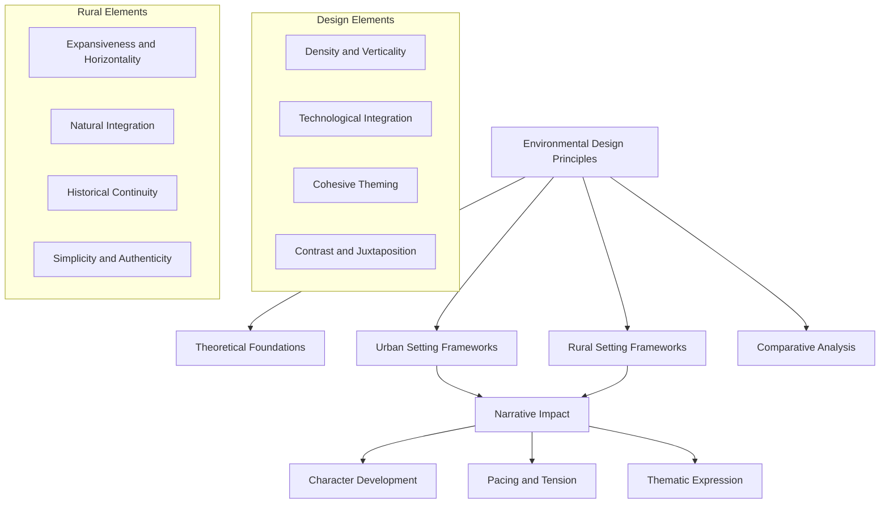

# Environmental Design Principles Research Summary

## Purpose
This document summarizes research findings on specialized frameworks for developing urban vs. rural settings and how environments shape narrative. It serves as a comprehensive reference for implementing environmental design principles within the narrative context network.

## Classification
- **Domain:** Environmental Design
- **Stability:** Established
- **Abstraction:** Methodological
- **Confidence:** Evidence-based

## Content

### Research Overview

This research explored specialized frameworks for developing urban versus rural settings in narrative contexts, focusing on how different environmental designs influence story elements, character development, and thematic expression. The goal was to identify established best practices and methodological approaches that could be incorporated into the narrative context network to enhance worldbuilding and setting development.

### 1. Fundamental Principles of Environmental Storytelling

#### Core Design Elements

**Composition & Staging**: The arrangement of environmental elements guides audience attention and establishes narrative focus. Strategic placement of objects, structures, and focal points creates visual pathways that lead the audience through the story in a controlled manner, emphasizing key narrative moments or thematic elements.

**Research and Reference**: Authentic environmental design requires thorough research and reference gathering to build believable worlds. This applies whether depicting realistic locations or fantastical realms, as even imagined environments must maintain internal consistency to remain credible.

**Color Theory**: Color palettes evoke specific emotional responses that support narrative tone. Warm colors might signify comfort, danger, or passion, while cool colors often represent calm, alienation, or authority, depending on context and cultural associations.

**Multi-sensory Engagement**: Effective environmental design engages multiple senses through visual effects, ambient sounds, and tactile elements, creating immersive environments that enhance narrative experience and audience engagement.

#### Theoretical Foundations

**Environmental Personification**: In powerful narrative environments, the setting becomes "a character in itself, influencing the mood, tone, and narrative of the story." This personification applies equally to urban skyscrapers and rural farmhouses.

**Emotional Resonance**: Effective environmental design considers "how the setting influences the emotions of how we relate to places, objects, and events." Both urban and rural settings can evoke strong emotional responses when designed with intentionality.

**Environmental Features as Storytelling Devices**: Physical elements within environments function as non-interactive storytelling elements. For example, a bloodstain that cannot be removed becomes a persistent reminder of past violence, part of the scenery that audiences observe but cannot alter.

### 2. Urban Environmental Design Framework

Urban settings present unique opportunities and challenges for environmental storytelling, requiring specific design approaches:

#### Structural Elements

**Density and Verticality**: Urban environments typically feature concentrated structures with vertical expansion, creating opportunities for layered storytelling and hierarchical social dynamics. Verticality can physically represent social stratification (penthouses vs. street level), power dynamics, or aspirational themes.

**Grid Systems and Disruption**: Urban planning often follows grid patterns, with narrative tension created through disruptions to this order. Neighborhoods that break from the grid may represent resistance, historical preservation, or social deviation.

**Boundaries and Thresholds**: Urban settings frequently employ boundaries between districts, neighborhoods, or zones that characters must cross, creating natural story thresholds and transition points.

#### Atmospheric Elements

**Technological Integration**: Modern urban settings often incorporate technology as both aesthetic and functional elements, reflecting themes of progress, surveillance, or alienation. The presence or absence of technology and its distribution across urban spaces can highlight social inequalities or cultural differences.

**Sensory Density**: Urban environments feature concentrated sensory experiences – amplified sounds, intense visual stimuli, and olfactory contrasts – that can be strategically employed to enhance specific narrative moments or establish distinct zones.

**Artificial Lighting**: The control and manipulation of light sources in urban settings creates dramatic possibilities unavailable in rural contexts, from neon-lit entertainment districts to shadowy alleyways or sterile office lighting.

#### Social Elements

**Crowds and Anonymity**: The presence of crowds enables stories about anonymity, chance encounters, or surveillance, while their absence during normally busy periods can signal danger or unnatural circumstances.

**Social Friction Points**: Areas where different social groups intersect (gentrifying neighborhoods, transportation hubs, public spaces) provide natural settings for conflict and character interaction.

**Visible Infrastructure**: Urban settings make social infrastructure visible (police stations, government buildings, financial institutions), allowing environments to physically represent societal systems and power structures.

### 3. Rural Environmental Design Framework

Rural settings employ different design principles to establish their narrative environments:

#### Structural Elements

**Expansiveness and Horizontality**: Unlike urban density, rural settings emphasize open spaces and horizontal landscapes, creating opportunities for stories about isolation, freedom, or connection to nature. The visual dominance of the horizon line often symbolizes possibility, longing, or the threshold between known and unknown.

**Negative Space**: Rural designs make strategic use of emptiness and distance, with isolation or the journey between points becoming narrative elements themselves.

**Natural Boundaries**: Geographic features like rivers, mountain ranges, or forests create natural boundaries that can represent psychological barriers, social divisions, or narrative thresholds.

#### Atmospheric Elements

**Natural Integration**: Rural environments typically feature stronger connections to natural elements, with weather, seasons, and landscapes playing more prominent roles in the narrative. These natural elements often function as plot devices, symbolic systems, or reflections of character psychology.

**Diurnal and Seasonal Cycles**: Rural settings typically emphasize natural time cycles more prominently than urban environments, using dawn, dusk, and seasonal changes to mark narrative progression or thematic shifts.

**Organic Soundscapes**: The acoustic environment of rural settings – from birdsong to wind through fields – creates distinctive mood regulation possibilities that contrast with urban soundscapes.

#### Social Elements

**Historical Continuity**: Rural settings often emphasize tradition and historical elements, using environmental features to convey the passage of time and generational stories. Architecture, land use patterns, and infrastructure frequently span multiple time periods, making history visibly present.

**Simplicity and Authenticity**: Design elements in rural settings frequently emphasize craftsmanship, functionality, and organic materials that reflect local traditions and resources, often symbolizing authenticity, tradition, or resistance to modernization.

**Community Visibility**: Unlike anonymous urban settings, rural environments often make community connections visible through shared spaces, common resources, and overlapping property boundaries.

### 4. Impact on Narrative Elements

The choice between urban and rural settings significantly influences key narrative elements:

#### Character Development

**Urban Character Frameworks**:
- Identity formation through professional role or social positioning rather than family heritage
- Development through navigation of complex social hierarchies and anonymous interactions
- Character tensions arising from proximity without intimacy
- Adaptation to rapid change and technological integration
- Specialization of skills and knowledge within complex systems

**Rural Character Frameworks**:
- Identity formation through relationship to land, community role, or family legacy
- Development through confrontation with natural elements or isolation
- Character tensions arising from intimacy without privacy
- Resistance or adaptation to outside influences and change
- Generalist skill development and self-sufficiency

#### Pacing and Tension

**Urban Pacing Frameworks**:
- Accelerated timing through dense interactions and multiple simultaneous events
- Tension through threatened privacy or unwanted exposure
- Conflict arising from competing interests in limited space
- Crisis moments through system failures (power outages, transit strikes, etc.)
- Transition through physical movement between distinct zones or districts

**Rural Pacing Frameworks**:
- Extended timing with emphasis on seasonal or natural rhythms
- Tension through isolation or environmental challenges
- Conflict arising from limited resources or resistant tradition
- Crisis moments through natural events (storms, drought, etc.)
- Transition through gradual environmental changes or significant journeys

#### Thematic Expression

**Urban Thematic Frameworks**:
- Progress vs. tradition
- Individual vs. collective
- Privacy vs. surveillance
- Efficiency vs. humanity
- Innovation vs. stability

**Rural Thematic Frameworks**:
- Nature vs. civilization
- Permanence vs. change
- Community vs. isolation
- Heritage vs. adaptation
- Simplicity vs. complexity

### 5. Integration Methodology

For effective implementation of environmental design principles in narrative contexts, consider the following methodological approach:

1. **Setting Classification**: Determine the primary environmental classification (urban, rural, or hybrid) based on narrative requirements.

2. **Framework Selection**: Select appropriate design frameworks based on setting classification and desired narrative impact.

3. **Element Mapping**: Identify specific environmental elements that will serve key narrative functions (character development, plot advancement, theme reinforcement).

4. **Contrast Integration**: Deliberately incorporate elements that create meaningful contrast within the environment to highlight thematic tensions.

5. **Sensory Detailing**: Develop multi-sensory aspects of the environment (visual, auditory, tactile, olfactory) to create immersive experiences.

6. **Narrative Testing**: Evaluate how environmental elements support or hinder narrative goals, adjusting as needed to strengthen story-environment alignment.

### 6. Application Examples

**Example 1: Urban Mystery Narrative**
- Implement vertical design to represent social hierarchy relevant to the mystery
- Use lighting contrasts between institutional spaces and hidden areas
- Develop sound design that masks or reveals crucial information
- Create environmental thresholds that mark character progression through the investigation

**Example 2: Rural Coming-of-Age Narrative**
- Design landscape elements that physically represent character growth challenges
- Implement seasonal changes that parallel emotional development
- Develop community spaces that showcase changing social relationships
- Create environmental motifs that recur throughout the character's journey

## Implementation Recommendations

1. **Create an Environmental Design Framework document** in the elements/settings directory, detailing the specific approaches for urban and rural settings.

2. **Develop integration guidelines** explaining how to align environmental design choices with character development, plot structure, and thematic elements.

3. **Create specialized templates** for urban and rural setting development that incorporate the identified principles.

4. **Establish environmental design checklists** to ensure consistency and narrative alignment during development.

## Research Sources

The research drew from multidisciplinary sources including:

1. Environmental storytelling principles in interactive media design
2. Urban planning and architectural theory
3. Rural sociology and landscape design
4. Narrative environment theory
5. Set design principles from film and theater
6. Environmental psychology
7. Cultural geography

## Research Limitations

This research focused primarily on contemporary Western conceptions of urban and rural environments. Further research could explore:

1. Non-Western approaches to environmental design in narrative
2. Historical variations in urban/rural distinctions
3. Hybrid or transitional environments (suburbia, exurbs, etc.)
4. Futuristic or speculative environmental design approaches
5. Application to specific genre requirements

## Relationships
- **Parent Nodes:** 
  - [context-network/planning/research_strategy.md] - implements - Research contributes to overall research strategy
  - [context-network/planning/future_research_directions.md] - fulfills - Completes planned research direction
- **Child Nodes:** 
  - [elements/settings/environmental_design_frameworks.md] - basis-for - Research serves as foundation for framework development
- **Related Nodes:** 
  - [elements/settings/overview.md] - enhances - Research enhances understanding of setting development
  - [elements/world/worldbuilding_frameworks.md] - complements - Environmental design works with worldbuilding frameworks
  - [elements/plot/scene_building_frameworks.md] - supports - Environmental design supports scene construction

## Navigation Guidance
- **Access Context:** Use this document when seeking foundational research on environmental design principles, particularly when contrasting urban and rural approaches
- **Common Next Steps:** After reviewing this research, proceed to the environmental_design_frameworks.md document for practical implementation details
- **Related Tasks:** Setting development, scene construction, character-environment interaction design
- **Update Patterns:** This document represents completed research and should remain stable unless significant new research emerges

## Metadata
- **Created:** 2025-05-21
- **Last Updated:** 2025-05-21
- **Updated By:** Cline Agent

## Change History
- 2025-05-21: Initial creation of research summary document
