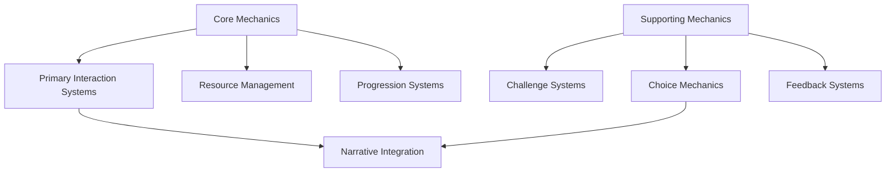

# Mechanics Overview

## Purpose
This document establishes the framework for developing, integrating, and balancing interactive mechanics within narrative projects such as RPGs, narrative games, and interactive fiction, ensuring gameplay elements support and enhance the storytelling experience.

## Classification
- **Domain:** Interactive Design
- **Stability:** Semi-stable
- **Abstraction:** Structural
- **Confidence:** Evolving

## Content

### Mechanics Development Philosophy

[Describe the overall approach to mechanics development for this narrative project, including the balance between gameplay and narrative, player agency, and design principles that guide mechanical implementation]

### Mechanics Categories

#### Core Mechanics
[Description of foundational gameplay systems that define the player experience]

**Primary Interaction Systems**
[Description of the main ways players interact with the game world]

**Resource Management**
[Description of resources players must manage and how they connect to narrative]

**Progression Systems**
[Description of how player/character advancement is structured]

#### Supporting Mechanics
[Description of secondary systems that enhance core gameplay]

**Challenge Systems**
[Description of obstacles, conflicts, and tests players must overcome]

**Choice Mechanics**
[Description of decision points and their implementation]

**Feedback Systems**
[Description of how the game communicates outcomes to players]

### Narrative-Mechanics Integration

#### Mechanics as Storytelling Tools

**Mechanical Metaphors**
[Description of how game mechanics can embody thematic elements]

**Ludonarrative Harmony**
[Description of aligning gameplay feelings with narrative intent]

**Procedural Rhetoric**
[Description of how systems themselves can communicate meaning]

#### Player Agency Framework

**Agency Spectrum**
[Description of different levels of player influence on narrative]

**Meaningful Choice Design**
[Description of creating choices with significant and perceivable consequences]

**Agency Illusions**
[Description of techniques for creating impression of greater agency]

#### Narrative-Mechanical Balance

**Pacing Considerations**
[Description of balancing gameplay and narrative delivery]

**Cognitive Load Management**
[Description of managing player attention between systems and story]

**Integration Techniques**
[Description of methods to seamlessly blend mechanics and narrative]

### Mechanical Design Elements

#### Rules Systems

**Core Rules**
[Description of fundamental mechanical principles]

**Exception-Based Design**
[Description of how special cases modify core rules]

**Consistency Framework**
[Description of maintaining logical consistency across mechanics]

#### Player Experience

**Challenge Calibration**
[Description of difficulty tuning approaches]

**Flow Channel Design**
[Description of maintaining engagement through appropriate challenge]

**Satisfaction Loops**
[Description of creating satisfying feedback cycles]

#### Balance Considerations

**Player Power Curve**
[Description of managing player effectiveness over time]

**Risk-Reward Structures**
[Description of balancing player choices with appropriate stakes]

**Mechanical Diversity**
[Description of providing varied gameplay experiences]

### Implementation Approaches

#### Mechanics Documentation

**System Documentation**
[Description of documenting rule systems effectively]

**Player-Facing Rules**
[Description of presenting rules to players clearly]

**Designer Notes**
[Description of capturing decision context and intent]

#### Testing Methodologies

**Mechanical Testing**
[Description of testing for functionality]

**Balance Testing**
[Description of testing for appropriate challenge]

**Narrative Integration Testing**
[Description of testing for successful mechanics-story integration]

#### Iteration Protocols

**Feedback Incorporation**
[Description of using playtest feedback effectively]

**Mechanical Refactoring**
[Description of revising systems while maintaining integrity]

**Version Control**
[Description of tracking mechanical changes]

### Special Considerations for Narrative Forms

#### For RPG Games/Modules

**Game Master Empowerment**
[Description of providing tools for GM narrative control]

**Character Creation Integration**
[Description of tying character mechanics to narrative role]

**Session Structure Support**
[Description of mechanics that support session pacing]

#### For Interactive Fiction

**Text Interaction Design**
[Description of parser or choice mechanics]

**State Tracking Systems**
[Description of managing narrative variables]

**Procedural Text Generation**
[Description of systems for dynamic text creation]

#### For Narrative Video Games

**Mechanical Storytelling**
[Description of letting gameplay itself convey narrative]

**Environmental Storytelling Systems**
[Description of mechanics that reveal narrative through environment]

**Cinematic Integration**
[Description of transitioning between gameplay and non-interactive narrative]

## Implementation Guidelines

### Mechanics Consistency Checklist
- [Consistency check 1]
- [Consistency check 2]
- [Consistency check 3]

### Mechanics Development Questions
- [Question to refine mechanics 1]
- [Question to refine mechanics 2]
- [Question to refine mechanics 3]

### Common Mechanics Issues and Solutions
- [Issue 1]: [Solution approach]
- [Issue 2]: [Solution approach]
- [Issue 3]: [Solution approach]

## Relationships
- **Parent Nodes:** [foundation/structure.md]
- **Child Nodes:** 
  - [elements/mechanics/rules.md] - details - Core rule systems
  - [elements/mechanics/progression.md] - details - Advancement structures
  - [elements/mechanics/integration.md] - implements - Narrative-mechanics integration
- **Related Nodes:** 
  - [elements/characters/overview.md] - implements - Characters realized through mechanical representation
  - [elements/plot/overview.md] - structures - Mechanics structure plot progression
  - [elements/world/overview.md] - instantiates - Mechanics instantiate world principles
  - [foundation/principles.md] - guided-by - Mechanical development follows narrative principles

## Navigation Guidance
- **Access Context:** Use this document when establishing mechanical frameworks, balancing gameplay systems, or integrating mechanics with narrative
- **Common Next Steps:** After reviewing mechanics overview, typically explore specific rule systems, progression structures, or integration approaches
- **Related Tasks:** System design, balancing, playtesting, narrative integration
- **Update Patterns:** This document should be updated when fundamental approaches to mechanics or gameplay philosophy change

## Metadata
- **Created:** [Date]
- **Last Updated:** [Date]
- **Updated By:** [Role/Agent]

## Change History
- [Date]: Initial creation of mechanics overview template
