# Narrative Frameworks Index

## Purpose
This document serves as a central index for all narrative frameworks implemented in the context network, providing an overview of available resources and guidance on how to navigate and apply them in narrative development.

## Classification
- **Domain:** Cross-Domain Index
- **Stability:** Evolving
- **Abstraction:** Navigational
- **Confidence:** Established

## Content

### Overview of Narrative Frameworks

This context network now contains a comprehensive collection of narrative frameworks covering worldbuilding, character naming, and plot/scene development. These frameworks represent consensus best practices drawn from multiple authoritative sources rather than single-author trademarked systems.

```mermaid
graph TD
    NF[Narrative Frameworks] --> WF[Worldbuilding Frameworks]
    NF --> CN[Character Naming Frameworks]
    NF --> PSB[Plot & Scene Building Frameworks]
    NF --> EDF[Environmental Design Frameworks]
    
    WF --> WP[Worldbuilding Principles]
    WF --> WS[Structural Frameworks]
    WF --> WC[Consistency Systems]
    WF --> WSP[Specialized Frameworks]
    
    CN --> CP[Naming Principles]
    CN --> CA[Cliché Avoidance]
    CN --> CS[Naming Systems]
    CN --> CT[Testing Methodologies]
    
    PSB --> PP[Plot Principles]
    PSB --> SB[Scene Building]
    PSB --> PD[Plot Development]
    PSB --> SA[Scene Analysis]
    
    EDF --> EP[Core Design Principles]
    EDF --> EU[Urban Frameworks]
    EDF --> ER[Rural Frameworks]
    EDF --> EI[Integration Methodology]
```

### Framework Categories

#### Environmental Design Frameworks
Located in: `elements/settings/environmental_design_frameworks.md`

This document provides specialized frameworks for developing urban and rural settings and how environments shape narrative elements:

- **Core Design Principles:**
  - Composition & Staging
  - Multi-sensory Engagement
  - Environmental Personification
  - Emotional Resonance

- **Urban Environmental Design Framework:**
  - Structural Elements (Density and Verticality, Grid Systems and Disruption, Boundaries and Thresholds)
  - Atmospheric Elements (Technological Integration, Sensory Density, Artificial Lighting)
  - Social Elements (Crowds and Anonymity, Social Friction Points, Visible Infrastructure)

- **Rural Environmental Design Framework:**
  - Structural Elements (Expansiveness and Horizontality, Negative Space, Natural Boundaries)
  - Atmospheric Elements (Natural Integration, Diurnal and Seasonal Cycles, Organic Soundscapes)
  - Social Elements (Historical Continuity, Simplicity and Authenticity, Community Visibility)

- **Narrative Impact Frameworks:**
  - Character Development Frameworks (Urban and Rural)
  - Pacing and Tension Frameworks (Urban and Rural)
  - Thematic Expression Frameworks (Urban and Rural)

- **Implementation Methodology:**
  - Setting Analysis Process
  - Framework Selection Process
  - Environmental Development Process
  - Narrative Integration Process
  - Review and Refinement Process

#### Worldbuilding Frameworks
Located in: `elements/world/worldbuilding_frameworks.md`

This document compiles frameworks for creating cohesive, believable, and engaging narrative worlds, including:

- **Foundational Worldbuilding Principles:**
  - Consistency Principle
  - Iceberg Principle
  - Interconnection Principle
  - Familiar-Strange Balance
  - Economy of Invention Principle

- **Structural Worldbuilding Frameworks:**
  - GRAPES Framework (Geography, Religion, Achievement, Politics, Economics, Social Structure)
  - Historical Layering Framework
  - Character-Centric Worldbuilding
  - Cultural Development Framework

- **World Consistency Systems:**
  - Consequence Mapping
  - Cultural-Environmental Feedback Loop
  - Timeline Consistency Verification

- **Specialized Worldbuilding Frameworks:**
  - Magic System Development Framework
  - Technology Integration Framework
  - Ecological Worldbuilding Framework
  - Religious System Development Framework
  - Economic System Development Framework
  - Linguistic Development Framework

#### Character Naming Frameworks
Located in: `elements/characters/naming_frameworks.md`

This document focuses specifically on approaches to character naming with emphasis on avoiding clichés, including:

- **Foundational Character Naming Principles:**
  - Phonological Significance Principle
  - Cultural Coherence Principle
  - Mnemonic Functionality Principle
  - Semantic Resonance Principle
  - Temporal-Technological Appropriateness Principle

- **Cliché Avoidance Frameworks:**
  - Fantasy Name Cliché Assessment Framework
  - Science Fiction Name Evolution Framework
  - Historical Fiction Authenticity Framework
  - Cross-Cultural Naming Sensitivity Framework

- **Character Naming Frameworks and Systems:**
  - Character-Name Resonance Framework
  - Sociological Naming System
  - Linguistic Consistency System
  - Chronological-Generational Naming Framework

- **Name Testing Methodologies:**
  - Pronunciation Testing
  - Association Testing
  - Distinctiveness Testing
  - Consistency Testing

#### Plot and Scene Building Frameworks
Located in: `elements/plot/scene_building_frameworks.md`

This document provides approaches to constructing effective plot structures and individual scenes, including:

- **Foundational Plot Structure Frameworks:**
  - Dramatic Arc Framework
  - Story Circle Framework
  - Conflict Framework
  - Narrative Causality Framework
  - Value Shift Framework

- **Scene Building Frameworks:**
  - Scene-Sequel Framework
  - Scene Purpose Framework
  - Scene Tension Framework
  - Scene Entrance/Exit Framework
  - Scene Information Management Framework

- **Plot Development Frameworks:**
  - Plot Embryo Framework
  - Multiple Storyline Framework
  - Narrative Pacing Framework
  - Plot Complication Framework
  - Narrative Reveal Framework
  - Emotional Resonance Mapping Framework
  - Transmedia Storytelling Framework
  - Genre-Specific Plot Frameworks
  - Cross-Cultural Storytelling Frameworks
  - Interactive Narrative Frameworks
  - Digital-Era Narrative Frameworks
  - Visual Storytelling Frameworks

- **Scene Analysis and Evaluation Frameworks:**
  - Scene Purpose Verification Framework
  - Scene Tension Evaluation Framework
  - Scene-Level Character Agency Framework
  - Scene Setting Integration Framework
  - Scene Dialogue Effectiveness Framework

#### Interactive Narrative Frameworks
Located in: `elements/plot/interactive_narrative_frameworks.md`

This document examines approaches to developing choice-based storytelling, branching narratives, and systems for user agency in interactive media:

- **Foundational Interactive Narrative Structures:**
  - Linear with Interactive Elements Framework
  - Branching Narrative Framework
  - Parallel Narrative Framework

- **Choice Design Frameworks:**
  - Meaningful Choice Architecture
  - Consequence Mapping System
  - Decision Point Architecture

- **Technical Implementation Frameworks:**
  - Drama Management System Framework
  - Branch Management Framework
  - State Tracking Architecture

- **Agency Management Frameworks:**
  - Agency Balancing Framework
  - Cognitive Load Management Framework
  - Narrative Coherence Preservation Framework

- **Integration Approaches:**
  - Medium-Specific Integration Framework
  - Hybrid Narrative Structures
  - Transmedia Implementation Framework

#### Digital-Era Narrative Frameworks
Located in: `elements/plot/digital_era_narrative_frameworks.md`

This document compiles frameworks for understanding and implementing narrative techniques shaped by modern technology, social media, digital communication, and virtual worlds:

- **Social Media Narrative Integration Frameworks:**
  - Three-Act Structure for Social Media
  - Freytag's Pyramid Adaptation for Short-Form Content
  - Before-After-Bridge Framework
  - Problem-Agitate-Solve Framework
  - Hero's Journey Adaptation for Brand Storytelling

- **Digital Communication Representation Systems:**
  - Multimedia Integration Framework
  - User-Generated Content Integration System
  - Transmedia Storytelling Framework

- **Virtual World Narrative Structure Frameworks:**
  - Storyliving Framework
  - Non-Linear Progression Systems
  - Guided Discovery Framework
  - Agency and Interaction Framework

- **Contemporary Technology Integration Guidelines:**
  - Seven-Element Approach to Digital Storytelling
  - Technological Abstraction Framework
  - Cross-Platform Narrative Consistency Framework

- **Attention Optimization Frameworks:**
  - Micro-Narrative Structure Framework
  - Visual-First Content Hierarchy
  - Episodic Content with Cliffhanger Integration
  - Neurological Engagement Optimization Framework

#### Cross-Cultural Storytelling Frameworks
Located in: `elements/plot/cross_cultural_storytelling_frameworks.md`

This document examines narrative structures and approaches from diverse cultural traditions, providing alternatives to Western storytelling conventions:

- **Universal and Cross-Cultural Patterns:**
  - Monomyth (Hero's Journey) with Cultural Variations
  - In Medias Res Applications Across Cultures
  - Petal Structure Framework

- **Indigenous Oral Traditions:**
  - Story Circles Framework
  - Cyclical Time Narrative Structure
  - Transformation & Fluidity Framework
  - Rhythmic Repetition & Audience Engagement Model
  - Active Natural World Narrative Approach

- **Eastern Storytelling Patterns:**
  - Collective Experience Focus Framework
  - Ambiguity and Open-Ended Resolution Approach
  - Non-Linear Temporal Structures

- **Comparative Framework Applications:**
  - Narrative Progression Spectrum (Linear vs. Cyclical/Non-Linear)
  - Focus Spectrum: Individual vs. Collective
  - Time Management Spectrum (Chronological vs. Layered/Blended)
  - Resolution Spectrum (Clear vs. Open-Ended/Ambiguous)
  - Environmental Role Spectrum (Background vs. Active Participant)
  - Audience Role Spectrum (Passive Recipient vs. Engaged Co-Author)

### Integration Points

These frameworks are designed to work together as an integrated system, with multiple connection points between different elements:

- **Worldbuilding → Character Development:**
  - Cultural frameworks inform character naming and background
  - World rules constrain character capabilities and challenges
  - Historical development shapes character perspectives

- **Character → Plot Development:**
  - Character traits drive believable plot decisions
  - Character naming reinforces narrative themes
  - Character arcs intertwine with plot progression

- **Plot → Worldbuilding:**
  - Plot events reveal world elements organically
  - World consistency shapes plot possibilities
  - Setting-specific scenes enhance world depth

### Application Guide

#### When to Apply Specific Frameworks

| Narrative Phase | Recommended Primary Frameworks | Supporting Frameworks |
|-----------------|--------------------------------|------------------------|
| Initial Concept | Story Circle, GRAPES, Value Shift | Conflict, Cultural Development |
| Early Development | Character-Centric Worldbuilding, Naming Principles, Plot Embryo | Multiple Storyline, Consistency Principle |
| Detailed Development | Scene Purpose, Historical Layering, Character-Name Resonance | Scene Tension, Specialized Worldbuilding |
| Revision/Refinement | Scene Analysis, Cliché Avoidance, Consistency Systems | Testing Methodologies, Scene-Level Agency |

#### Framework Selection Process

1. Identify the specific narrative need or challenge
2. Review applicable framework categories
3. Select primary framework that best addresses core need
4. Identify supporting frameworks for complexity and depth
5. Apply frameworks with appropriate adaptations for genre and medium

#### Cross-Framework Workflows

**World-to-Character-to-Plot Workflow:**
1. Use GRAPES Framework to establish world foundations
2. Apply Cultural Development Framework to create distinctive cultures
3. Use Cultural Naming Pattern Template for consistent character naming
4. Apply Character-Name Resonance Framework for meaningful character names
5. Use Story Circle Framework to develop character journeys within world
6. Apply Scene Purpose Framework to create scenes that reveal characters and world

**Plot-to-Character-to-World Workflow:**
1. Begin with Dramatic Arc Framework to establish overall narrative shape
2. Use Value Shift Framework to identify core value conflicts
3. Apply Character-Name Resonance Framework to develop characters that embody these values
4. Use Character-Centric Worldbuilding to expand world from character experience
5. Apply Historical Layering to develop world context that supports plot
6. Use Scene-Sequel Framework to develop scene progression

## Implementation Approach

### Framework Application Process

1. **Assessment Phase:**
   - Review narrative goals and requirements
   - Identify applicable framework categories
   - Select primary frameworks for application

2. **Integration Phase:**
   - Apply selected frameworks to narrative elements
   - Identify and resolve framework conflicts
   - Document application decisions for consistency

3. **Evaluation Phase:**
   - Test framework application against narrative goals
   - Identify areas requiring refinement
   - Iterate and adjust as needed

4. **Documentation Phase:**
   - Record specific framework applications
   - Document adaptations and modifications
   - Create reference materials for continued application

### Framework Customization Guidelines

- Adapt frameworks to genre-specific requirements
- Modify frameworks based on medium constraints
- Combine frameworks to address specific narrative needs
- Document customizations for consistent application

## Relationships
- **Parent Nodes:** [foundation/structure.md]
- **Child Nodes:** 
  - [elements/world/worldbuilding_frameworks.md] - details - Worldbuilding frameworks
  - [elements/characters/naming_frameworks.md] - details - Character naming frameworks
  - [elements/plot/scene_building_frameworks.md] - details - Plot and scene building frameworks
  - [elements/settings/environmental_design_frameworks.md] - details - Environmental design frameworks
- **Related Nodes:** 
  - [elements/world/overview.md] - enhances - Frameworks enhance worldbuilding approach
  - [elements/characters/overview.md] - enhances - Frameworks enhance character development
  - [elements/plot/overview.md] - enhances - Frameworks enhance plot construction
  - [planning/research_strategy.md] - implements - This document implements the research strategy

## Navigation Guidance
- **Access Context:** Use this document when seeking appropriate frameworks for specific narrative development needs
- **Common Next Steps:** After reviewing this index, proceed to specific framework documents based on current narrative focus
- **Related Tasks:** Narrative planning, framework selection, cross-domain integration
- **Update Patterns:** This document should be updated when new frameworks are added or existing frameworks are significantly modified

## Metadata
- **Created:** [Current Date]
- **Last Updated:** [Current Date]
- **Updated By:** Cline Agent

## Change History
- [Current Date]: Initial creation of narrative frameworks index
