# Digital-Era Narrative Frameworks

## Purpose
This document compiles frameworks for understanding and implementing narrative techniques shaped by modern technology, social media, digital communication, and virtual worlds. These frameworks represent consensus approaches from across digital media theory, interactive design, and contemporary storytelling practice.

## Classification
- **Domain:** Plot Development
- **Stability:** Evolving
- **Abstraction:** Methodological
- **Confidence:** Established

## Content

### Overview of Digital-Era Narrative Conventions

Digital-era narrative conventions reflect the profound transformation of storytelling through technological innovation. These frameworks provide systematic approaches to developing narratives that leverage the unique capabilities of digital platforms while maintaining narrative coherence and emotional impact.

```mermaid
flowchart TD
    A[Digital-Era Narrative Frameworks] --> B[Social Media Narratives]
    A --> C[Digital Communication]
    A --> D[Virtual World Structures]
    A --> E[Technology Integration]
    A --> F[Attention Optimization]
    
    B --> B1[Short-Form Structure]
    B --> B2[Platform-Specific Approaches]
    B --> B3[Community Integration]
    
    C --> C1[Multimedia Integration]
    C --> C2[User-Generated Content]
    C --> C3[Transmedia Storytelling]
    
    D --> D1[Storyliving Framework]
    D --> D2[Non-Linear Progression]
    D --> D3[Agency and Interaction]
    
    E --> E1[Technological Abstraction]
    E --> E2[Cross-Platform Consistency]
    E --> E3[Future-Proofing Methods]
    
    F --> F1[Micro-Narrative Structures]
    F --> F2[Visual-First Design]
    F --> F3[Neurological Engagement]
```

### 1. Social Media Narrative Integration Frameworks

#### Three-Act Structure for Social Media
- **Definition:** An adaptation of the classic three-act structure (setup, confrontation, resolution) optimized for concise social media storytelling.
- **Key Components:**
  - Compressed setup phase with immediate hook
  - Accelerated conflict introduction
  - Rapid resolution with clear takeaway
  - Visual punctuation between acts
- **Application Guidelines:**
  - Design introductions that establish context within seconds
  - Create visual/textual patterns to signal act transitions
  - Develop resolution that encourages sharing or further engagement
  - Balance brevity with sufficient emotional resonance
- **Implementation Process:**
  1. Identify core narrative in single-sentence form
  2. Develop visual hook that establishes context
  3. Create conflict or question that drives middle section
  4. Design resolution that feels both satisfying and shareable
  5. Add platform-appropriate engagement prompts

#### Freytag's Pyramid Adaptation for Short-Form Content
- **Definition:** A modified five-act structure (exposition, rising action, climax, falling action, dénouement) compressed for digital formats while preserving dramatic impact.
- **Key Components:**
  - Exposition integrated with inciting incident
  - Accelerated rising action with clear progression
  - Visually/emotionally distinct climactic moment
  - Compressed falling action and resolution
- **Application Guidelines:**
  - Establish exposition through visual context rather than explanation
  - Use pacing variation to create sense of building momentum
  - Design distinct visual/audio cues for climactic moment
  - Create resolution that connects to beginning element
- **Examples:** Documentary-style TikTok series, Instagram story narratives with episodic structure

#### Before-After-Bridge Framework
- **Definition:** A three-part narrative structure showing current state ("before"), desired future ("after"), and pathway connecting them ("bridge").
- **Key Components:**
  - Relatable "before" state that resonates with audience
  - Aspirational "after" state visualizing improvement
  - Practical "bridge" explaining transformation process
  - Clear causal connection between elements
- **Application Guidelines:**
  - Use authentic, relatable elements in "before" state
  - Create emotionally compelling contrast in "after" state
  - Develop credible, actionable "bridge" between states
  - Maintain consistent character/setting across all three phases
- **Implementation Process:**
  1. Identify pain point or challenge for "before" state
  2. Visualize improved condition for "after" state
  3. Develop clear pathway connecting the states
  4. Create consistent visual language across all phases

#### Problem-Agitate-Solve Framework
- **Definition:** A narrative structure that identifies a problem, intensifies the emotional impact of that problem, then introduces a solution.
- **Key Components:**
  - Clear problem identification that resonates with audience
  - Emotional agitation phase highlighting consequences
  - Solution presentation with clear implementation path
  - Consistent narrative voice across all three phases
- **Application Guidelines:**
  - Focus on universal or audience-specific problems
  - Use storytelling techniques during agitation phase
  - Present solution with emphasis on transformation
  - Incorporate proof elements to establish credibility
- **Variant: PASTOR Framework:**
  - Person/Problem: Identify audience and challenge
  - Amplify: Intensify consequences of problem
  - Story/Solution: Present narrative illustrating solution
  - Transformation: Show before/after contrast
  - Offer: Provide clear next steps
  - Response: Include call to action

#### Hero's Journey Adaptation for Brand Storytelling
- **Definition:** A condensed version of Campbell's monomyth structure adapted for digital platforms where audiences are positioned as heroes encountering challenges.
- **Key Components:**
  - Audience as hero (rather than brand)
  - Challenge/ordinary world establishment
  - Brand as mentor/magical aid
  - Transformation through product/service
  - Return with newfound capability/knowledge
- **Application Guidelines:**
  - Position audience clearly as protagonist
  - Establish relatable ordinary world challenges
  - Introduce brand as guide rather than hero
  - Showcase transformation through authentic stories
  - Create shareable resolution that inspires others
- **Digital Adaptation Considerations:**
  - Compress cycle for platform attention constraints
  - Use visual storytelling to imply rather than explain stages
  - Create participation opportunities at key journey points
  - Design for multi-episode engagement when appropriate

### 2. Digital Communication Representation Systems

#### Multimedia Integration Framework
- **Definition:** A systematic approach to combining multiple media types (text, image, audio, video) to create cohesive narrative experiences.
- **Key Components:**
  - Media type selection hierarchy
  - Modal complementarity mapping
  - Sensory engagement balance
  - Cognitive load management
- **Application Guidelines:**
  - Match media types to narrative functions
  - Create complementary rather than redundant elements
  - Design transitions between media types
  - Maintain consistent narrative voice across modalities
  - Balance sensory stimulation with cognitive processing needs
- **Implementation Framework:**
  1. Map narrative elements to optimal media types
  2. Develop integration points between modalities
  3. Create consistent visual/verbal language across media
  4. Test cognitive processing across integrated elements
  5. Refine transitions between modalities

#### User-Generated Content Integration System
- **Definition:** A framework for incorporating audience-created content into cohesive narrative experiences.
- **Key Components:**
  - Participation architecture designing opportunities for contribution
  - Curation mechanisms for selecting/highlighting contributions
  - Integration techniques for maintaining narrative coherence
  - Attribution and community recognition systems
- **Application Guidelines:**
  - Design clear participation parameters that guide contributions
  - Create contribution frameworks that maintain narrative consistency 
  - Develop moderation systems that respect community while ensuring quality
  - Implement recognition mechanisms that incentivize participation
- **UGC Integration Models:**
  1. **Collective World-Building:** Community contributions expand narrative world
  2. **Character Development:** Audience input shapes character decisions/growth
  3. **Distributed Storytelling:** Multiple contributors create interconnected narratives
  4. **Remix Culture:** Original content transformed through audience modification
  5. **Response Narratives:** Original prompts generating audience narrative responses

#### Transmedia Storytelling Framework
- **Definition:** A methodology for creating narrative experiences that unfold across multiple platforms, with each platform contributing unique elements to a unified storyworld.
- **Key Components:**
  - Story world bible documenting consistent elements
  - Platform-specific narrative strength mapping
  - Timeline and synchronization management
  - Discovery path design
  - Canon management system
- **Application Guidelines:**
  - Match narrative elements to platforms where they'll be most effective
  - Create entry points on multiple platforms for diverse audience access
  - Design consistent world rules that operate across all platforms
  - Develop platform-specific experiences that feel complete while connecting to larger narrative
  - Implement discovery mechanics that reward cross-platform engagement
- **Implementation Process:**
  1. Create comprehensive story world documentation
  2. Map platform-specific strengths to narrative elements
  3. Design narrative elements requiring cross-platform engagement
  4. Develop platform-appropriate entry points
  5. Create discovery paths that guide audience across platforms

### 3. Virtual World Narrative Structure Frameworks

#### Storyliving Framework
- **Definition:** A framework for transforming passive narrative consumption into active participation where audiences become agents within narrative worlds.
- **Key Components:**
  - Participant role definition within narrative
  - Agency spectrum mapping participant influence
  - Environmental storytelling integration
  - Consequence design for participant actions
- **Application Guidelines:**
  - Define clear participant role in narrative world
  - Design environmental elements that convey story without exposition
  - Create meaningful consequences for participant choices
  - Develop narrative elements that respond to participant behavior
  - Balance authored narrative with emergence opportunities
- **Implementation Levels:**
  1. **Observer-Plus:** Limited interaction within largely fixed narrative
  2. **Influential Participant:** Meaningful choices affecting predetermined outcomes
  3. **Co-Author:** Significant narrative agency within defined boundaries
  4. **World Inhabitant:** Open-ended narrative emerging from environment and systems

#### Non-Linear Progression Systems
- **Definition:** Frameworks for creating coherent narrative experiences that don't follow traditional linear progression but adapt to user choices and behaviors.
- **Key Components:**
  - Narrative node mapping
  - Conditional progression triggers
  - State tracking architecture
  - Narrative satisfaction verification
- **Application Guidelines:**
  - Design narrative nodes that function in multiple sequences
  - Create conditional triggers that feel natural rather than mechanical
  - Implement state tracking that maintains consistency
  - Verify narrative satisfaction across possible pathways
  - Develop replayability through meaningful variation
- **Non-Linear Structures:**
  1. **Open World:** Geographic exploration driving narrative discovery
  2. **Branching:** Decision points creating divergent pathways
  3. **Hub-and-Spoke:** Central anchor with optional narrative branches
  4. **Parallel Tracks:** Multiple simultaneous narrative threads
  5. **Modular:** Self-contained episodes arrangeable in variable sequence

#### Guided Discovery Framework
- **Definition:** A methodology for subtly directing participant attention and movement within virtual spaces while maintaining the perception of complete agency.
- **Key Components:**
  - Environmental cue system (light, sound, movement)
  - Curiosity gap implementation
  - Navigation optimization
  - Discovery reward structures
- **Application Guidelines:**
  - Design subtle directional cues using light, color, and sound
  - Create curiosity gaps that naturally draw participant attention
  - Implement rewarding discoveries that reinforce exploration
  - Develop environmental storytelling that pays attention to detail
  - Create multiple concurrent guidance systems for different player types
- **Implementation Techniques:**
  1. Lighting design that highlights narrative pathways
  2. Audio cues that indicate importance or direction
  3. Environmental design creating natural movement flows
  4. Visual focal points drawing attention to narrative elements
  5. Reward systems encouraging desired exploration patterns

#### Agency and Interaction Framework
- **Definition:** A system for designing meaningful participant actions within virtual narrative spaces that balance freedom with narrative purpose.
- **Key Components:**
  - Interaction typology (exploration, manipulation, dialogue, creation)
  - Consequence mapping for participant actions
  - Feedback system design
  - Agency calibration tools
- **Application Guidelines:**
  - Design interactions that serve narrative purpose
  - Create consistent interaction language across experience
  - Develop feedback systems that confirm agency
  - Balance freedom with necessary constraints
  - Implement progressive interaction complexity
- **Agency Types:**
  1. **Exploratory Agency:** Freedom to discover narrative elements
  2. **Interpretive Agency:** Ability to derive personal meaning
  3. **Strategic Agency:** Choice of approach to challenges
  4. **Expressive Agency:** Self-representation within narrative
  5. **Narrative Agency:** Influence over plot development

### 4. Contemporary Technology Integration Guidelines

#### Seven-Element Approach to Digital Storytelling
- **Definition:** A comprehensive methodology for creating digital narratives with lasting impact by emphasizing research, personal connection, and deliberate technical choices.
- **Key Components:**
  1. Point of View: Establishing clear perspective
  2. Dramatic Question: Central tension driving narrative
  3. Emotional Content: Authentic feeling guiding engagement
  4. Voice: Distinct narrative perspective
  5. Soundtrack: Audio enhancement of emotional impact
  6. Economy: Efficiency in conveying narrative
  7. Pacing: Rhythm control for engagement
- **Application Guidelines:**
  - Select appropriate digital tools based on narrative needs
  - Develop narrative structure before production begins
  - Focus on emotional authenticity over technical complexity
  - Create interlinked thought flow for narrative coherence
  - Use technical elements to enhance rather than replace storytelling

#### Technological Abstraction Framework
- **Definition:** A methodology for creating technology-enhanced narratives that remain relevant despite rapid technological change.
- **Key Components:**
  - Technology role classification (essential vs. enhancing)
  - Abstraction layer development
  - Universal experience mapping
  - Adaptation pathway planning
- **Application Guidelines:**
  - Identify core narrative elements independent of specific technology
  - Create technology-agnostic version of key story elements
  - Design for adaptation across different technological contexts
  - Focus on human elements that transcend technological change
  - Develop narrative components that can migrate across platforms
- **Implementation Process:**
  1. Separate essential narrative from technology-specific elements
  2. Identify universal human experiences in narrative
  3. Create modular components adaptable to multiple technologies
  4. Design technology-specific enhancements as non-critical layers
  5. Document adaptation pathways for future technological shifts

#### Cross-Platform Narrative Consistency Framework
- **Definition:** A system for maintaining coherent narrative experiences across multiple technological platforms with different capabilities and constraints.
- **Key Components:**
  - Core narrative element identification
  - Platform-specific adaptation guidelines
  - Consistency verification tools
  - Translation protocols between platforms
- **Application Guidelines:**
  - Identify narrative elements requiring absolute consistency
  - Create platform-specific expression guidelines for these elements
  - Develop processes for ensuring consistency during implementation
  - Implement verification systems for cross-platform experience
  - Design for platform-appropriate expression of consistent elements
- **Consistency Domains:**
  1. **Character Consistency:** Maintaining coherent personality and motivation
  2. **World Logic Consistency:** Ensuring consistent rules and possibilities
  3. **Narrative Tone Consistency:** Preserving emotional and stylistic qualities
  4. **Thematic Consistency:** Reinforcing core ideas across platforms
  5. **Brand/IP Consistency:** Maintaining recognizable proprietary elements

### 5. Attention Optimization Frameworks

#### Micro-Narrative Structure Framework
- **Definition:** A methodology for creating complete narrative experiences in extremely condensed timeframes optimized for digital attention patterns.
- **Key Components:**
  - Ultra-compression techniques for narrative elements
  - Emotional shorthand development
  - Visual storytelling optimization
  - Implied narrative techniques
- **Application Guidelines:**
  - Focus on singular emotional impact or idea
  - Use cultural shorthand and archetypal elements
  - Create visual composition that implies larger context
  - Develop multi-layered content rewarding repeat engagement
  - Design for both immediate impact and deeper examination
- **Implementation Framework:**
  1. Identify core narrative essence in single sentence
  2. Develop visual/textual elements implying larger context
  3. Create immediate emotional hook within first seconds
  4. Design efficient path to narrative resolution
  5. Add depth elements for engaged viewers

#### Visual-First Content Hierarchy
- **Definition:** A framework prioritizing visual communication as primary narrative carrier with supporting text/audio elements.
- **Key Components:**
  - Visual narrative structure templates
  - Text-visual integration patterns
  - Attention direction techniques
  - Platform-specific visual optimization
- **Application Guidelines:**
  - Design core narrative to be comprehensible through visuals alone
  - Create text elements that enhance rather than explain visuals
  - Develop consistent visual language across narrative
  - Optimize visual elements for platform-specific consumption
  - Implement progressive disclosure of text elements
- **Implementation Process:**
  1. Storyboard narrative with visuals as primary carrier
  2. Identify points requiring textual enhancement
  3. Design visual flow optimized for platform consumption patterns
  4. Create text elements with complementary function
  5. Test comprehension with visuals-only version

#### Episodic Content with Cliffhanger Integration
- **Definition:** A framework for designing serialized content with optimal engagement hooks to maintain audience across multiple installments.
- **Key Components:**
  - Episode structure templates
  - Cliffhanger typology and selection criteria
  - Recapping mechanisms
  - Audience retention tracking
- **Application Guidelines:**
  - Design episodes with both standalone and serial value
  - Create variable cliffhanger types across series
  - Develop efficient recapping techniques for returning audience
  - Implement narrative questions operating across multiple timescales
  - Balance resolution satisfaction with continuation desire
- **Cliffhanger Types:**
  1. **Threat Cliffhanger:** Character in immediate danger
  2. **Question Cliffhanger:** Critical information withheld
  3. **Decision Cliffhanger:** Character facing consequential choice
  4. **Revelation Cliffhanger:** New information changing perspective
  5. **Twist Cliffhanger:** Unexpected development altering understanding

#### Neurological Engagement Optimization Framework
- **Definition:** A system for designing narratives that leverage understanding of brain function to enhance attention, memory, and emotional impact.
- **Key Components:**
  - Dopamine trigger mapping
  - Emotional activation techniques
  - Memory formation optimization
  - Attention maintenance patterns
- **Application Guidelines:**
  - Create regular novel elements to maintain dopamine response
  - Design emotional triggers activating limbic system engagement
  - Develop multi-sensory elements to enhance memory formation
  - Implement variable stimulation patterns to prevent habituation
  - Balance cognitive load with processing capability
- **Implementation Elements:**
  1. Pattern interruptions maintaining alertness
  2. Emotional resonance triggers activating amygdala
  3. Multi-sensory integration enhancing hippocampal encoding
  4. Curiosity gaps stimulating information-seeking behavior
  5. Reward mechanisms encouraging continued engagement

## Implementation Guide

### Selecting Appropriate Digital Frameworks

When developing digital-era narratives, consider the following factors:

1. **Platform Context:**
   - Native content consumption patterns
   - User interaction expectations
   - Technical capabilities and constraints
   - Audience attention patterns

2. **Content Purpose:**
   - Entertainment vs. information vs. persuasion
   - Emotional vs. intellectual engagement priority
   - Brand/creator consistency requirements
   - Shareability objectives

3. **Audience Factors:**
   - Digital literacy level
   - Platform usage patterns
   - Attention availability
   - Consumption environment

4. **Production Resources:**
   - Technical production capabilities
   - Content creation timeline
   - Multi-platform management capacity
   - Maintenance requirements

### Implementation Process

1. **Planning Phase:**
   - Select appropriate structural frameworks based on platform and purpose
   - Design content architecture incorporating selected frameworks
   - Map engagement points and attention maintenance strategy
   - Develop platform-specific implementation approach

2. **Development Phase:**
   - Create core narrative elements with platform optimization
   - Develop technical infrastructure for chosen frameworks
   - Build engagement and interaction mechanisms
   - Implement measurement systems for effectiveness

3. **Testing Phase:**
   - Verify engagement patterns match objectives
   - Test across different devices and consumption contexts
   - Evaluate cognitive load and attention maintenance
   - Assess emotional impact and message retention

4. **Optimization Phase:**
   - Refine based on engagement analytics
   - Adjust elements with lower than expected performance
   - Enhance high-performing components
   - Update based on platform evolution

### Common Pitfalls and Solutions

| Pitfall | Solution |
|---------|----------|
| Platform overextension diluting narrative | Focus on platforms most aligned with content type |
| Technical features overshadowing story | Prioritize narrative integrity over technical novelty |
| Rapid platform obsolescence | Implement technological abstraction framework |
| Attention fatigue from overstimulation | Balance stimulation with cognitive breathing room |
| Misalignment between content and platform | Match content type to platform-appropriate frameworks |
| Loss of narrative coherence across platforms | Implement cross-platform consistency framework |
| Prioritizing novelty over effectiveness | Test engagement impact of new approaches |

## Relationships
- **Parent Nodes:** 
  - [elements/plot/overview.md] - extends - Expands plot frameworks to include digital-era structures
- **Child Nodes:** 
  - [future implementation-specific documents]
- **Related Nodes:** 
  - [elements/plot/interactive_narrative_frameworks.md] - complements - Digital frameworks overlap with interactive approaches
  - [elements/narrative_frameworks_index.md] - indexed-by - Referenced in the narrative frameworks index
  - [planning/future_research_directions.md] - fulfills - Implements research direction on digital-era conventions

## Navigation Guidance
- **Access Context:** Use this document when designing narratives for digital platforms, social media, or technology-enhanced storytelling
- **Common Next Steps:** After reviewing these frameworks, consider specific implementation approaches for your chosen digital platforms
- **Related Tasks:** Digital content planning, social media storytelling, transmedia narrative design
- **Update Patterns:** This document will evolve as new digital platforms emerge and consumption patterns change

## Metadata
- **Created:** 2025-05-21
- **Last Updated:** 2025-05-21
- **Updated By:** Cline Agent

## Change History
- 2025-05-21: Initial creation of digital-era narrative frameworks document based on research findings
