# Genre-Specific Plot Frameworks

## Purpose
This document catalogues plot structures, frameworks, and conventions specific to different literary genres, providing guidance for narrative development tailored to genre expectations while enabling creative innovation within established boundaries.

## Classification
- **Domain:** Plot Development
- **Stability:** Established
- **Abstraction:** Framework
- **Confidence:** Research-Backed

## Content

### Overview of Genre-Specific Plot Development

Different genres employ specialized frameworks that align with reader expectations while enabling authors to innovate within established boundaries. These genre-specific structures influence character development, pacing, thematic elements, and overall narrative architecture.

```mermaid
graph TD
    A[Genre-Specific Plot Frameworks] --> B[Fantasy]
    A --> C[Science Fiction]
    A --> D[Mystery/Thriller]
    A --> E[Romance]
    A --> F[Horror]
    A --> G[Literary Fiction]
    
    B --> B1[Hero's Journey]
    B --> B2[Three-Act Structure]
    B --> B3[Seven-Point Story]
    
    C --> C1[Hard/Soft SF Structures]
    C --> C2[Multi-Generational Arcs]
    C --> C3[Fichtean Curve]
    
    D --> D1[Inverted Structures]
    D --> D2[Five-Stage Quest]
    D --> D3[Whydunit Beat Sheet]
    
    E --> E1[Romancing the Beat]
    E --> E2[HEA Progression]
    E --> E3[Romance Arc Template]
    
    F --> F1[Three-Act Threat Progression]
    F --> F2[Tragic Pyramid]
    F --> F3[Cyclical Horror]
    
    G --> G1[Causative Linkages]
    G --> G2[Nonlinear Chronologies]
    G --> G3[Multiple Throughlines]
```

### Fantasy Genre Frameworks

#### Core Plot Structures

The fantasy genre commonly employs three primary structural frameworks, each suited to different types of fantasy narratives:

1. **The Hero's Journey Framework**
   - Organizes narratives into distinct stages including the Call to Adventure, Trials, and Return With Elixir
   - Ideal for epic fantasy featuring protagonists who must confront existential threats
   - Enables cyclical character growth through symbolic challenges and transformative experiences
   - Examples: J.R.R. Tolkien's *The Lord of the Rings*, Ursula K. Le Guin's *A Wizard of Earthsea*

2. **Three-Act Structure for Secondary World Building**
   - Provides linear progression ideal for introducing readers to complex fantasy worlds
   - Act 1 (Setup): Introduces protagonist and initial worldbuilding elements
   - Act 2 (Confrontation): Expands magical systems, political intrigue, and cultural depth
   - Act 3 (Resolution): Culminates in magical/political resolution that ties world elements together
   - Allows incremental reveals of fantasy elements without overwhelming exposition

3. **Seven-Point Story Structure**
   - Emphasizes pivotal moments in fantasy narratives:
     - Hook: Introduces protagonist in their ordinary world
     - Plot Turn 1: Inciting incident involving magical or fantastical element
     - Pinch Point 1: First major challenge revealing antagonistic forces
     - Midpoint: Protagonist shifts from reactive to proactive
     - Pinch Point 2: Major setback often involving sacrifice
     - Plot Turn 2: Key revelation or acquisition of needed power/knowledge
     - Resolution: Final confrontation integrating character growth and world stakes
   - Aligns plot milestones with protagonist's moral evolution and magical development

#### Character Development Conventions

Fantasy genre conventions demand specific approaches to character development:

1. **Power-Vulnerability Balance**
   - Characters must balance supernatural abilities with human vulnerabilities
   - Magical powers should have corresponding costs, limitations, or vulnerabilities
   - Internal conflicts often mirror external magical conflicts
   - Example: A wizard's mastery over elemental forces might coexist with crippling self-doubt

2. **World-Character Integration**
   - Character traits must logically derive from fantasy world elements
   - Cultures shaped by magical phenomena (eternal winters, floating cities) necessitate adaptive traits
   - Character histories should intertwine with world histories
   - Character beliefs should reflect magical/religious systems of the fantasy world

3. **Mentor-Protégé Dynamics**
   - Crucial relationship for knowledge transmission in magical systems
   - Often structures the early narrative phases
   - Creates tension between tradition and innovation
   - Provides exposition vehicle for world history and magical rules

#### Implementation Frameworks

1. **Snowflake Method for Fantasy**
   - Randy Ingermanson's approach adapted to fantasy contexts
   - Expands fractal-like from single-sentence premises to complex narratives
   - Ensures coherence across sprawling sagas with multiple characters and plotlines
   - Process:
     - Start with one-sentence premise featuring core fantasy concept
     - Expand to paragraph including major plot turns and magical elements
     - Develop character sketches highlighting magical abilities and world connections
     - Expand plot synopsis addressing magical system rules and world constraints
     - Develop detailed character descriptions including relationship to magic
     - Expand scene descriptions with worldbuilding elements integrated

2. **Fantasy World-Plot Integration Framework**
   - Ensures consistent relationship between fantasy elements and plot development
   - Maps magical system elements to plot milestones
   - Creates causality between world rules and plot events
   - Verifies that fantasy elements drive plot rather than acting as mere decoration
   - Checks that plot resolutions honor established magical rules

### Science Fiction Genre Frameworks

#### Core Plot Structures

Science fiction employs distinctive structures that accommodate its speculative elements and technological focus:

1. **Hard vs. Soft SF Structural Dichotomy**
   - Hard SF prioritizes scientific accuracy through rigorous cause-effect chains
     - Resembles thriller pacing with emphasis on problem-solving
     - Technical challenges and solutions drive plot progression
     - Examples: Andy Weir's *The Martian*, Arthur C. Clarke's works
   - Soft SF explores philosophical themes via more flexible narrative approaches
     - Often employs nonlinear timelines similar to literary fiction
     - Prioritizes social implications over technical accuracy
     - Examples: Ursula K. Le Guin's *The Left Hand of Darkness*, Ted Chiang's stories

2. **Multi-Generational Arc Structure**
   - Interweaves technological advancements with sociopolitical shifts over extended timelines
   - Contrasts immediate protagonist goals against epochal change
   - Often employs multiple POV characters across different time periods
   - Examples: Isaac Asimov's *Foundation* series, Olaf Stapledon's *Last and First Men*

3. **Fichtean Curve for Technological Crisis**
   - Bypasses extensive exposition by plunging characters into cascading crises
   - Particularly effective for near-future scenarios requiring minimal worldbuilding
   - Structure rises through increasingly complex technological challenges
   - Revelation of scientific principles occurs through problem-solving rather than exposition
   - Examples: Michael Crichton's works, Blake Crouch's *Dark Matter*

#### Character Development Conventions

Science fiction demands specific character development approaches:

1. **Technological Adaptation Focus**
   - Characters defined by their relationship to speculative technologies
   - Development arcs often track changing attitudes toward technology
   - Internal conflicts frequently mirror broader social debates about progress
   - Example: Characters in a post-singularity world struggling with human identity

2. **Ethical Expansion Through Speculation**
   - Character moral frameworks challenged by technological possibilities
   - Development involves expanding ethical thinking beyond contemporary limitations
   - Characters often represent different philosophical positions on speculative issues
   - Moral growth involves reconciling human values with technological change

3. **Institutional vs. Individual Dynamics**
   - Characters positioned in relationship to technological systems/institutions
   - Protagonists frequently embody intellectual curiosity or rebellious pragmatism
   - Antagonists often represent institutional stagnation or unchecked innovation
   - Character development tracks changing relationship to authority structures

#### Implementation Frameworks

1. **Speculation-Plot Integration Framework**
   - Ensures speculative elements drive narrative rather than serving as setting
   - Maps technological concepts to plot points and character development
   - Verifies that narrative explores consequences of speculative elements
   - Structure:
     - Identify core speculation (technology, social change, etc.)
     - Map primary consequences across social/political/personal domains
     - Develop characters embodying different responses to speculation
     - Create plot points revealing unforeseen consequences
     - Ensure resolution addresses speculation's ultimate impact

2. **Dramatica Theory Four-Act Model for SF**
   - Addresses internal/external conflicts paralleling humanity's struggle with technology
   - Four distinct throughlines: Overall Story, Main Character, Impact Character, Relationship
   - Ensures thematic cohesion amidst complex plotting
   - Maps technological impact across personal, interpersonal, and societal levels
   - Particularly effective for narratives exploring technology's psychological impacts

### Mystery/Thriller Genre Frameworks

#### Core Plot Structures

Mystery narratives employ structures specifically designed to balance clue revelation with suspense:

1. **Inverted Structure**
   - Reveals crime/incident early, then backtracks through investigation
   - Prioritizes "howcatchem" or "whydunit" over "whodunit"
   - Structure follows detective's methodical analysis rather than chronological events
   - Examples: Columbo television series, Fyodor Dostoevsky's *Crime and Punishment*

2. **Five-Stage Quest Model**
   - Reframes physical searches as intellectual pursuits
   - Stages: Call (case presentation), Journey (investigation), Arrival (key revelation), Final Ordeal (confrontation), Goal (resolution)
   - Truth itself becomes the grail object of the quest
   - Each stage reveals new aspects of the mystery while raising new questions
   - Examples: Agatha Christie's Poirot novels, Tana French's Dublin Murder Squad series

3. **Classic Mystery Structure**
   - Presents crime/puzzle early to establish stakes
   - Introduces limited suspect pool with clear motives, means, and opportunities
   - Distributes genuine clues among red herrings at measured intervals
   - Builds to revelation scene where detective explains solution
   - Often includes final twist or reversal after apparent resolution
   - Examples: Arthur Conan Doyle's Sherlock Holmes stories, classic whodunits

#### Character Development Conventions

Mystery genre demands specific character attributes and development patterns:

1. **Detective Archetype Evolution**
   - Protagonists require sharp observational skills offset by personal flaws
   - Common flaws include addiction, social ineptitude, or past trauma
   - Character development creates tension between professional competence and private turbulence
   - Growth often involves resolving personal mystery parallel to external case
   - Examples: Sherlock Holmes's addiction, Hercule Poirot's outsider status

2. **Suspect-Mirror Function**
   - Secondary characters serve dual roles as both suspects and mirrors
   - Reflect protagonist's unresolved traumas or moral questions
   - Character development occurs through elimination process as suspects reveal truths
   - Reinforces genre's thematic focus on concealed identities and hidden motives
   - Often perpetrator represents shadow aspect of detective

3. **Truth-Seeker's Paradox**
   - Detective characters must balance pursuit of truth with potential harm of revelations
   - Development frequently involves questioning the value of knowledge
   - Character arc explores cost of clarity and whether some mysteries should remain unsolved
   - Examples: Detectives who choose not to reveal solutions that would cause more harm

#### Implementation Frameworks

1. **Whydunit Beat Sheet**
   - Organizes clues and revelations around pivotal twists
   - Ensures fair play with readers while maintaining suspense
   - Structure includes:
     - Crime establishment (what happened)
     - Initial investigation (first theories)
     - False lead (convincing wrong direction)
     - Complication (new information challenging assumptions)
     - Personal stake revelation (why detective can't let go)
     - Midpoint revelation (game-changing clue)
     - Raised stakes (time pressure or additional threat)
     - Red herring exposure (eliminating false theories)
     - Darkest moment (detective's crisis of confidence)
     - Final clue recognition (detective understands truth)
     - Confrontation (facing the perpetrator)
     - Resolution (explaining the solution)

2. **Story Genius Method for Mystery**
   - Prioritizes character-driven motivations over plot mechanics
   - Aligns sleuth's personal stakes with broader investigative arcs
   - Starts with detective's misbelief or internal problem
   - Creates investigation that forces confrontation with internal issues
   - Maps external clues to internal realizations
   - Ensures mystery resolution also resolves character arc

### Romance Genre Frameworks

#### Core Plot Structures

Romance narratives follow strictly defined emotional arcs with specific milestones:

1. **Romancing the Beat Structure**
   - Divides romance narratives into four phases:
     - Setup: Establishes protagonists in their separate worlds
     - Falling in Love: Tracks initial attraction through deepening connection
     - Confrontation: Tests relationship through conflict and separation
     - Resolution: Reconciles differences leading to committed union
   - Each phase contains specific emotional milestones:
     - Meet Cute: Initial encounter establishing chemistry
     - No Way: Recognition of obstacles to relationship
     - Midpoint: Moment of intimacy or commitment
     - Black Moment: Apparent irreconcilable separation
     - Grand Gesture: Active choice to overcome final barriers
   - Ensures consistent chemistry development between lead characters
   - Examples: Classic romance novels, romantic comedies

2. **HEA/HFN Progression**
   - Structures narrative to guarantee Happily Ever After or Happy For Now ending
   - Plot builds through emotional conflicts rather than physical dangers
   - Character growth directly enhances romantic compatibility
   - Turning points marked by emotional vulnerability rather than external events
   - Examples: Traditional romance novels across subgenres

3. **Relationship Arc Structure**
   - Maps narrative to stages of real relationship development
   - Moves through attraction, compatibility testing, conflict, and commitment
   - Dialogue-heavy scenes alternate with introspection
   - Internal conflicts (fear, past trauma) mirror external obstacles
   - Examples: Contemporary romance focusing on psychological realism

#### Character Development Conventions

Romance genre demands specific character dynamics and development patterns:

1. **Complementary Flaws System**
   - Characters exhibit complementary flaws driving initial conflict
   - Development involves recognizing how partner addresses personal weaknesses
   - Character growth directly enhances romantic compatibility
   - Example: Orderly protagonist paired with spontaneous partner learns flexibility

2. **Forced Proximity Revelation**
   - Character traits revealed through institutional settings or forced proximity
   - Tropes like workplace romance or stranded together facilitate organic interaction
   - Development occurs through compromises required by shared circumstances
   - Character growth measured by adaptation to partner's needs

3. **Relational Identity Evolution**
   - Characters begin with incomplete or flawed self-concept
   - Development involves discovering authentic self through romantic relationship
   - Growth combines independence with healthy dependence
   - Culminates in characters who are stronger together while maintaining individuality

#### Implementation Frameworks

1. **Romance Arc Template**
   - Ensures balanced pacing between external obstacles and internal growth
   - Structures turning points around emotional realizations rather than plot events
   - Maps physical intimacy progression to emotional development
   - Integrates subplot relationships reinforcing central romantic themes
   - Balances genre tropes with fresh situational elements

2. **Internal/External Barrier Framework**
   - Systematically develops obstacles to relationship:
     - External barriers: circumstances, rivals, family opposition
     - Internal barriers: fears, traumas, misconceptions, values conflicts
   - Maps resolution path for each barrier type
   - Ensures barriers are substantial enough for meaningful conflict
   - Verifies that overcoming barriers requires genuine character growth

### Horror Genre Frameworks

#### Core Plot Structures

Horror employs distinctive structures designed to build and release tension in specific patterns:

1. **Three-Act Threat Progression**
   - Act 1: Introduces menace through subtle signs and isolated incidents
   - Act 2: Expands threat reach through escalating attacks and failed countermeasures
   - Act 3: Forces final confrontation after maximum isolation and vulnerability
   - Examples: Classic monster narratives, slasher films, haunted house stories

2. **Tragic Pyramid Adaptation**
   - Modifies Freytag's Pyramid to accommodate horror's pessimistic tendencies
   - Exposition: Establishes normalcy with subtle wrongness
   - Rising Action: Escalating encounters with supernatural/threat
   - Climax: Full revelation of horror's nature/extent
   - Falling Action: Attempted escape or resolution
   - Catastrophe: Tragic ending or contaminated victory
   - Particularly effective for slasher subgenres allowing tragic endings
   - Examples: Classic supernatural horror, cosmic horror

3. **Cyclical Horror Structure**
   - Implies endless recursive terrors beyond resolution
   - Initial horror contained or escaped, but seeds planted for recurrence
   - Final scene echoes opening, suggesting inescapable cycle
   - Often includes epilogue hinting at continued threat
   - Examples: Many horror franchises, cosmic horror, curse narratives

#### Character Development Conventions

Horror demands specific character traits and development patterns:

1. **Vulnerability-Focused Characterization**
   - Prioritizes vulnerability over heroism
   - Protagonists often underprepared civilians facing overwhelming threats
   - Character flaws directly contribute to danger (curiosity, hubris)
   - Secondary characters serve "meat grinder" roles highlighting threat's power
   - Development measured through psychological breakdown and survival adaptation

2. **Psychological Deterioration Arc**
   - Characters experience progressive psychological unraveling
   - Development tracks coping mechanisms from denial to acceptance
   - Internal states mirror external horrors (paranoia, delusions)
   - Growth paradoxically involves recognizing the reality of the unbelievable
   - Internal conflicts often include survivor guilt, moral compromises, or contagion fear

3. **Final Girl/Survivor Evolution**
   - Character begins with distinguishing trait separating them from victims
   - Development involves progressive hardening through trauma
   - Transformation from ordinary person to worthy adversary for the threat
   - Often includes corrupted victory where survivor adopts aspects of the horror
   - Examples: Final girls in slasher films, sole survivors in monster narratives

#### Implementation Frameworks

1. **Schematic Horror Indexing System**
   - Maps progressive revelation of horror capabilities
   - Controls information release to maintain suspense:
     - Initial Hint Phase: Subtle environmental changes without direct threats
     - Glimpse Phase: Partial sightings or secondary effects of threat
     - Encounter Phase: Direct but survivable interaction with limited threat aspect
     - Understanding Phase: Comprehension of threat's nature and full capabilities
     - Confrontation Phase: Full engagement with completely revealed threat
   - Techniques include:
     - Masking monster's powers through partial glimpses
     - Revealing capabilities gradually through environmental destruction
     - Building suspense by withholding complete visual revelation

2. **Setting as Psychological Landscape Framework**
   - Develops settings as external manifestations of character psychology
   - Maps character journey through increasingly hostile environments
   - Employs labyrinthine structures reflecting confusion and entrapment
   - Creates progressive isolation through setting constraints
   - Techniques include:
     - Establishing safe zones that gradually shrink
     - Creating thresholds marking psychological transitions
     - Developing symbolic locations reflecting character fears
     - Employing setting elements that force confrontation with phobias

### Literary Fiction Frameworks

#### Core Plot Structures

Literary fiction employs more flexible structures prioritizing thematic development and character psychology:

1. **Causative Linkage Structure**
   - Prioritizes subtle cause-effect connections over dramatic plot mechanics
   - Each event triggers subsequent emotional realignments
   - Plot derived directly from character decisions rather than external forces
   - Emphasis on psychological consequences over external action
   - Examples: Alice Munro's short stories, Anne Tyler's novels

2. **Nonlinear Chronology Structures**
   - Employs circular, fragmented, or recursive timelines
   - Organizes events by emotional or thematic connections rather than chronology
   - Structure reflects protagonists' internal landscapes
   - Examples: Virginia Woolf's modernist stream of consciousness, Toni Morrison's *Beloved*

3. **Subtle Momentum Structure**
   - Focuses on gradual accumulation of small events leading to significant change
   - Often tracks social/cultural pressures rather than dramatic incidents
   - Employs recurring motifs rather than clear plot milestones
   - Examples: William Faulkner's narratives of rural decay, John Steinbeck's social novels

#### Character Development Conventions

Literary fiction employs distinctive approaches to character development:

1. **Contradiction-Centered Characterization**
   - Characters embody contradictions avoiding easily definable archetypes
   - Development reveals increasing complexity rather than resolution
   - Emphasis on eccentricities and moral ambiguities
   - Characters often resist redemption or clean narrative arcs
   - Examples: Flannery O'Connor's morally complex characters, Jonathan Franzen's family portraits

2. **Evolving Motivation Pattern**
   - Character motivations shift subtly throughout narrative
   - Actions stem from complex, sometimes unconscious drives
   - Development emphasizes process over outcome
   - Example: Elena Ferrante's Neapolitan quartet where lifelong friendship fluctuates between devotion and resentment without clear resolution

3. **Societal Position Dynamics**
   - Characters developed through their relationship to social structures
   - Growth involves changing relationship to class, gender, race, or cultural expectations
   - Internal conflicts reflect broader societal tensions
   - Development often left deliberately unresolved to reflect real-world complexity
   - Examples: Zadie Smith's characters navigating cultural identities, Chimamanda Ngozi Adichie's exploration of emigration and return

#### Implementation Frameworks

1. **Multiple Throughline Integration**
   - Ensures layered thematic cohesion by tracking multiple narrative threads
   - Explores individual and collective consciousness simultaneously
   - Maps character journeys against societal or historical developments
   - Techniques include:
     - Parallel character journeys with thematic connections
     - Contrasting perspectives on shared events
     - Generational patterns revealing historical continuities
     - Recurring objects or locations connecting disparate narratives

2. **Story Genius Backstory Framework**
   - Emphasizes backstory integration forging cause-effect chains spanning decades
   - Justifies seemingly arbitrary choices with psychological depth
   - Structure includes:
     - Identifying character's formative experiences and resulting misbeliefs
     - Creating present-day triggers for unresolved past conflicts
     - Developing scenes revealing backstory's continuing influence
     - Establishing thematic connections between past and present
     - Resolving present conflicts through confrontation with past

### Cross-Genre Implementation Guidelines

#### Hybrid Genre Approaches

Many effective narratives blend elements from multiple genre frameworks:

1. **Mystery-Fantasy Hybrid Implementation**
   - Combines detective framework with magical systems
   - Integrates clue revelation with world-building
   - Balances fair-play mystery conventions with fantasy elements
   - Example: Ben Aaronovitch's *Rivers of London* series, Jim Butcher's *Dresden Files*

2. **Science Fiction-Horror Integration**
   - Merges technological speculation with psychological deterioration
   - Combines scientific explanation with inexplicable fear
   - Balances rational problem-solving with irrational terror
   - Examples: Alien films, Jeff VanderMeer's *Southern Reach* trilogy

3. **Literary-Genre Fusion Approaches**
   - Applies literary fiction's psychological depth to genre frameworks
   - Maintains genre plot structure while adding character complexity
   - Foregrounds societal themes within genre conventions
   - Examples: Margaret Atwood's speculative fiction, Colson Whitehead's *The Underground Railroad*

#### Framework Selection Process

When selecting genre frameworks, consider:

1. **Primary vs. Secondary Genre Elements**
   - Identify the dominant genre governing main plot structure
   - Select secondary genres providing character development or subplot structures
   - Ensure consistency between primary plot framework and character arcs
   - Example: Primary mystery structure with romance subplot requires coordination between investigation milestones and relationship development

2. **Audience Expectation Management**
   - Consider how firmly established reader expectations are for chosen genre
   - Determine which conventions must be honored vs. which can be subverted
   - Signal genre intentions early to establish appropriate reader expectations
   - Maintain consistent tone appropriate to primary genre

3. **Structural Compatibility Assessment**
   - Evaluate whether selected frameworks complement or conflict
   - Identify shared structural elements across genres
   - Resolve conflicts by prioritizing frameworks based on narrative goals
   - Example: Horror's psychological deterioration may conflict with romance's growth pattern, requiring careful integration

## Relationships
- **Parent Nodes:** 
  - [elements/plot/overview.md] - expands - Develops plot approaches with genre specificity
  - [elements/narrative_frameworks_index.md] - implements - Executes research direction for genre frameworks

- **Child Nodes:** 
  - [future detailed framework implementations]

- **Related Nodes:** 
  - [elements/world/worldbuilding_frameworks.md] - complements - Worldbuilding must align with genre-specific plot structures
  - [elements/characters/naming_frameworks.md] - influences - Character naming should reflect genre conventions
  - [planning/future_research_directions.md] - fulfills - Implements priority research area
  - [elements/plot/scene_building_frameworks.md] - extends - General scene frameworks are modified by genre requirements

## Navigation Guidance
- **Access Context:** Use this document when selecting plot frameworks for a specific genre or when combining elements across genres
- **Common Next Steps:** After selecting appropriate genre frameworks, consult related documents on character development and worldbuilding aligned with chosen genre
- **Related Tasks:** Genre selection, plot structuring, narrative pacing, character arc development
- **Update Patterns:** This document should be expanded as additional genre frameworks are researched and as hybrid approaches evolve

## Metadata
- **Created:** 2025-05-21
- **Last Updated:** 2025-05-21
- **Updated By:** Cline Agent

## Change History
- 2025-05-21: Initial creation based on genre-specific plot structures research
