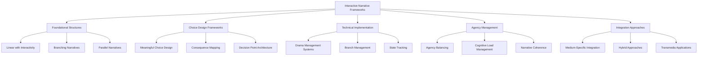

# Interactive Narrative Frameworks

## Purpose
This document compiles frameworks for developing choice-based storytelling, branching narratives, and systems that enable user agency in interactive media. These frameworks represent consensus approaches from across narrative theory, game design, and interactive fiction development.

## Classification
- **Domain:** Plot Development
- **Stability:** Evolving
- **Abstraction:** Methodological
- **Confidence:** Established

## Content

### Overview of Interactive Narrative Structures

Interactive narrative structures transform traditional storytelling by enabling audience participation in shaping the narrative experience. These frameworks provide systematic approaches to designing choice-based stories that balance authored content with user agency.

### 1. Foundational Interactive Narrative Structures

#### Linear with Interactive Elements Framework
- **Definition:** A primarily linear narrative structure that incorporates limited interactive elements without significantly altering the main plot trajectory.
- **Key Components:**
  - Environmental exploration options
  - Dialogue variations with consistent outcomes
  - Parallel side content that enriches but doesn't alter the main narrative
  - Optional challenges or puzzles that provide agency within confined spaces
- **Application Guidelines:**
  - Use to deliver cohesive, author-driven stories while providing sense of participation
  - Implement "corridor-style" progression with meaningful side activities
  - Design interactions that reveal character/world details without disrupting pacing
  - Create illusion of choice through varied paths to same outcome
- **Examples:** Action-adventure games with fixed plots but player-driven exploration, interactive films with minor variations

#### Branching Narrative Framework
- **Definition:** A structure where user decisions create diverging storylines leading to multiple potential outcomes and endings.
- **Key Components:**
  - Decision points that meaningfully alter narrative direction
  - Multiple end states reflecting cumulative choices
  - Consequence tracking system for choice persistence
  - Variable relationship systems affected by decisions
- **Application Guidelines:**
  - Design clear decision points with transparent stakes
  - Balance branch complexity with production feasibility
  - Implement choice-merging strategies to manage scope
  - Create variable narrative elements that reflect past decisions
  - Design branches that meaningfully explore thematic variations
- **Examples:** Choose-your-own-adventure stories, role-playing games with multiple endings

#### Parallel Narrative Framework
- **Definition:** A hybrid structure that allows for localized branching before reconverging to key plot points, balancing player choice with narrative cohesion.
- **Key Components:**
  - Branch points that diverge temporarily
  - Convergence nodes that bring varied paths together
  - Variable context markers that persist across convergence
  - Modular scene design for recombination
- **Application Guidelines:**
  - Identify critical plot milestones for convergence
  - Design variations that affect context but preserve core progression
  - Create modular content that can be repurposed across branches
  - Implement state tracking for consistent character relationships
  - Balance player perception of choice with narrative necessity
- **Examples:** Episodic adventure games, interactive narratives with multiple paths to similar endpoints

### 2. Choice Design Frameworks

#### Meaningful Choice Architecture
- **Definition:** A system for designing decisions that have clear, significant, and perceptible consequences on the narrative.
- **Key Components:**
  - Value conflict decisions (contrasting valid options)
  - Transparent stakes and potential outcomes
  - Clear causal linkage between choices and consequences
  - Delayed impact mechanisms for long-term significance
- **Application Guidelines:**
  - Design choices that reflect genuine narrative questions
  - Avoid arbitrary or deceptive choice structures
  - Create decisions that explore thematic dimensions
  - Implement both immediate and delayed consequences
  - Ensure choices reflect character development opportunities
- **Implementation Framework:**
  1. Identify the narrative question the choice addresses
  2. Design options that represent contrasting values or approaches
  3. Create consequences that meaningfully impact subsequent story
  4. Implement feedback systems that remind users of their choices
  5. Connect choices to thematic dimensions of the overall narrative

#### Consequence Mapping System
- **Definition:** A methodology for planning, tracking, and implementing the effects of user decisions throughout a narrative.
- **Key Components:**
  - Decision tree documentation
  - State-variable tracking
  - Conditional content triggers
  - Cumulative effect calculations
- **Application Guidelines:**
  - Map primary, secondary, and tertiary effects of each choice
  - Design variable state systems that persists across story segments
  - Create weighted consequence models for complex decision trees
  - Implement memory systems for narrative consistency
  - Balance immediate feedback with delayed consequences
- **Implementation Framework:**
  1. Create comprehensive decision maps with all branches
  2. Identify critical variables affected by each decision
  3. Design tracking systems for persistent state changes
  4. Implement conditional content that responds to variable states
  5. Test for consistency and expected outcome delivery

#### Decision Point Architecture
- **Definition:** A framework for strategically placing and designing moments of user agency within a narrative.
- **Key Components:**
  - Pacing-based decision placement
  - Agency intensity variation
  - Cognitive load management
  - Choice type diversification
- **Application Guidelines:**
  - Place major decisions at natural dramatic junctures
  - Alternate between high and low agency segments
  - Vary decision types (moral, strategic, personal, etc.)
  - Design choice mechanics appropriate to medium
  - Create breathing space between significant choices
- **Decision Point Types:**
  1. **Defining Choices:** Major decisions with far-reaching consequences
  2. **Characterizing Choices:** Decisions that establish character traits and relationships
  3. **Tactical Choices:** Short-term decisions with localized impact
  4. **Exploratory Choices:** Decisions that reveal information or content
  5. **Expressive Choices:** Decisions that allow personal expression without major narrative impact

### 3. Technical Implementation Frameworks

#### Drama Management System Framework
- **Definition:** An architectural approach for dynamically managing narrative flow in response to user decisions while maintaining dramatic coherence.
- **Key Components:**
  - User model (tracking preferences and behaviors)
  - Drama model (defining desired narrative qualities)
  - Agent model (controlling non-player characters)
  - Evaluation mechanisms for narrative quality
- **Application Guidelines:**
  - Design adaptive systems that respond to user patterns
  - Implement subtle guidance mechanisms that preserve agency
  - Create dynamic difficulty and emotional pacing systems
  - Balance between predominated events and emergent outcomes
  - Develop meta-level narrative intelligence for coherence
- **Implementation Approaches:**
  1. **Search-Based Drama Management:** Evaluates possible story paths to select optimal directions
  2. **Reactive Drama Management:** Responds to immediate user actions with context-appropriate content
  3. **Director-Agent Systems:** Uses intelligent agents to guide narrative progression
  4. **Pacing Regulation Systems:** Dynamically adjusts story rhythm based on user engagement

#### Branch Management Framework
- **Definition:** A system for managing the complexity of multiple narrative branches without exponential content creation.
- **Key Components:**
  - Bottleneck design (strategic convergence points)
  - Modular content architecture
  - Variable context persistence
  - Late-binding content generation
- **Application Guidelines:**
  - Identify strategic convergence points without invalidating choices
  - Design modular scenes adaptable to multiple narrative states
  - Implement context markers that preserve choice significance
  - Create reusable narrative components with variable parameters
  - Develop efficient testing methodologies for branch combinations
- **Content Management Strategies:**
  1. **Foldback Schemes:** Creating convergences that feel natural to each branching path
  2. **Parallel Content:** Developing scenes that functionally provide similar progression differently
  3. **Variable Layering:** Using consistent base content with variable contextual elements
  4. **Procedural Modification:** Algorithmically adjusting content based on previous choices

#### State Tracking Architecture
- **Definition:** A framework for recording, maintaining, and utilizing narrative states and variables affected by user choices.
- **Key Components:**
  - Global and local state variables
  - Relationship tracking systems
  - History logging mechanisms
  - Conditional content triggers
- **Application Guidelines:**
  - Design comprehensive variable systems for narrative elements
  - Implement persistent state storage across narrative segments
  - Create hierarchical state importance for optimization
  - Develop testing tools for state consistency
  - Balance complexity with performance requirements
- **Implementation Framework:**
  1. Identify critical narrative variables requiring persistence
  2. Design appropriate variable types for different state needs
  3. Implement state change triggers connected to user choices
  4. Create conditional content systems responding to states
  5. Develop debugging systems for state inspection and validation

### 4. Agency Management Frameworks

#### Agency Balancing Framework
- **Definition:** A methodology for calibrating the relationship between user freedom and authored narrative to create satisfying experiences.
- **Key Components:**
  - Agency spectrum mapping
  - Control-coherence balance mechanisms
  - Satisfaction evaluation metrics
  - Expectation management systems
- **Application Guidelines:**
  - Match agency level to audience expectations and medium
  - Design transparent agency boundaries
  - Create meaningful agency within constrained spaces
  - Develop narrative systems that adapt to player expression
  - Balance breadth and depth of choice impacts
- **Agency Types:**
  1. **Interpretive Agency:** Freedom to interpret narrative text or events
  2. **Explorative Agency:** Freedom to discover content in self-directed order
  3. **Strategic Agency:** Freedom to determine approaches to challenges
  4. **Narrative Agency:** Freedom to influence plot development and outcomes
  5. **Creative Agency:** Freedom to contribute content to the narrative world

#### Cognitive Load Management Framework
- **Definition:** A system for designing interactive narratives that prevent decision fatigue and cognitive overload.
- **Key Components:**
  - Decision complexity calibration
  - Information flow regulation
  - Choice frequency modulation
  - Cognitive rest design
- **Application Guidelines:**
  - Balance decision complexity with frequency
  - Design clear information presentation for informed choices
  - Create pacing that alternates high and low cognitive demands
  - Implement sufficient time for reflection between major decisions
  - Develop progressive complexity that builds decision-making skills
- **Implementation Strategies:**
  1. Design clear consequences for major decisions
  2. Create breathing room between significant choices
  3. Implement information management systems that prevent overload
  4. Develop UI/UX that clarifies decision parameters
  5. Create "cognitive rest" segments that pause decision pressure

#### Narrative Coherence Preservation Framework
- **Definition:** A methodology for maintaining thematic, character, and plot consistency across variable narrative paths.
- **Key Components:**
  - Thematic anchoring systems
  - Character consistency mechanisms
  - Plot logic verification tools
  - World rule persistence
- **Application Guidelines:**
  - Identify core narrative elements that must remain consistent
  - Design character models that adapt consistently to choices
  - Create thematic frameworks that transcend specific path variations
  - Implement world rules that provide consistent boundaries
  - Develop testing methodologies for coherence verification
- **Coherence Strategies:**
  1. **Character-Based Coherence:** Ensuring characters react plausibly across all paths
  2. **Thematic Unity:** Maintaining consistent themes regardless of choices
  3. **Causal Consistency:** Ensuring logical cause-effect relationships in all branches
  4. **World Rule Persistence:** Maintaining consistent world rules regardless of path
  5. **Motivation Clarity:** Ensuring character motivations remain comprehensible

### 5. Integration Approaches

#### Medium-Specific Integration Framework
- **Definition:** A framework for adapting interactive narrative techniques to specific media formats.
- **Key Components:**
  - Medium constraint analysis
  - Interface design patterns
  - Input mechanism optimization
  - Feedback system design
- **Application Guidelines for Various Media:**
  - **Video Games:** Leverage seamless integration of gameplay and narrative choice
  - **Interactive Fiction:** Focus on textual clarity and economy of choice
  - **Touch Interfaces:** Design gesture-based interaction that feels natural
  - **Voice Interfaces:** Create conversational decision mechanisms
  - **VR/AR:** Implement spatial and embodied choice mechanics
  - **Physical Media:** Design tangible interaction patterns
- **Design Framework:**
  1. Analyze medium affordances and limitations
  2. Design interaction patterns native to the medium
  3. Create appropriate feedback mechanisms
  4. Implement agency appropriate to interface constraints
  5. Test for medium-specific user experience

#### Hybrid Narrative Structures
- **Definition:** A framework for combining multiple interactive narrative approaches in cohesive systems.
- **Key Components:**
  - Structure transition design
  - Agency spectrum variation
  - Modular architecture for mixed approaches
  - Signposting systems for model changes
- **Application Guidelines:**
  - Design clear transitions between narrative modes
  - Create signposting for changes in agency or structure
  - Implement consistent interaction patterns across models
  - Develop appropriate agency expectations for each segment
  - Balance varied structures for pacing and engagement
- **Common Hybrid Approaches:**
  1. **Hub-and-Spoke:** Central linear narrative with branching side content
  2. **Phased Agency:** Alternating between high and low agency segments
  3. **Layered Choice:** Multiple simultaneous choice systems affecting different narrative elements
  4. **Telescope Structure:** Broad early choices narrowing to focused conclusions
  5. **Agency Graduation:** Progressive increase in choice impact throughout narrative

#### Transmedia Implementation Framework
- **Definition:** A methodology for creating consistent interactive narrative experiences across multiple platforms and media.
- **Key Components:**
  - Cross-platform state persistence
  - Media-appropriate choice design
  - Narrative synchronization mechanisms
  - Platform-specific strength utilization
- **Application Guidelines:**
  - Design core narrative elements that transfer across media
  - Create platform-specific interaction patterns that feel native
  - Implement synchronized state systems across platforms
  - Develop media-appropriate agency expectations
  - Balance standalone value with transmedia enrichment
- **Implementation Strategies:**
  1. Identify platform-specific strengths for narrative elements
  2. Design persistent narrative elements that transfer across media
  3. Create appropriate agency models for each platform
  4. Implement synchronized data systems for cross-platform consistency
  5. Develop platform-appropriate onboarding for cross-media users

### 6. Emerging Frameworks and Future Directions

#### AI-Enhanced Narrative Systems
- **Definition:** Frameworks incorporating artificial intelligence to create more responsive, dynamic narrative experiences.
- **Key Components:**
  - NPC behavioral autonomy
  - Adaptive script generation
  - Dynamic narrative adjustment
  - Player pattern recognition
- **Emerging Applications:**
  - Characters with goal-oriented autonomy and persistent memory
  - Procedurally generated dialogue responsive to player choices
  - Dynamic difficulty and emotional pacing adjustments
  - Personalized narrative content based on player preferences
  - Narrative repair systems that maintain coherence during unexpected choices

#### Collaborative Multi-User Narrative Frameworks
- **Definition:** Systems for managing interactive narratives with multiple simultaneous users affecting the story.
- **Key Components:**
  - Consensus management mechanisms
  - Influence distribution systems
  - Parallel agency tracking
  - Social dynamic integration
- **Design Considerations:**
  - Balancing individual agency with group coherence
  - Creating meaningful roles within shared narratives
  - Developing conflict resolution systems for narrative direction
  - Implementing personalized experiences within shared worlds
  - Designing for varied participation levels and styles

#### Procedural Narrative Generation Frameworks
- **Definition:** Systems for algorithmically creating narrative content that responds to user choices while maintaining coherence.
- **Key Components:**
  - Narrative grammar systems
  - Template-based generation
  - Quality assurance mechanisms
  - Human-AI collaboration workflows
- **Current Limitations and Future Potential:**
  - Current systems excel at microstories but struggle with extended coherence
  - Emerging models show promise for dynamic character development
  - Hybrid approaches combining authored content with generative elements
  - Potential for infinite narratives with consistent thematic exploration
  - Evolving quality control mechanisms for generated content

## Implementation Guide

### Selecting Appropriate Interactive Frameworks

When developing interactive narratives, consider the following factors:

1. **Medium Constraints:**
   - Available input mechanisms
   - Display capabilities
   - Processing limitations
   - User interaction expectations

2. **Target Audience:**
   - Familiarity with interactive narratives
   - Genre expectations
   - Tolerance for complexity
   - Desired agency level

3. **Production Resources:**
   - Content creation capacity
   - Technical implementation capabilities
   - Testing resources for branch verification
   - Maintenance requirements

4. **Narrative Goals:**
   - Thematic exploration priorities
   - Character development focus
   - World-building objectives
   - Emotional impact targets

### Implementation Process

1. **Planning Phase:**
   - Select appropriate structural frameworks
   - Design choice architecture
   - Map narrative branches
   - Define state tracking requirements

2. **Development Phase:**
   - Implement technical systems for state management
   - Create modular content for branches
   - Develop feedback mechanisms
   - Build testing tools for branch verification

3. **Testing Phase:**
   - Verify narrative coherence across all paths
   - Test for cognitive load issues
   - Evaluate meaningful impact of choices
   - Assess pacing and emotional arcs

4. **Refinement Phase:**
   - Adjust based on testing feedback
   - Optimize problematic branches
   - Enhance feedback for important choices
   - Calibrate difficulty and cognitive demands

### Common Pitfalls and Solutions

| Pitfall | Solution |
|---------|----------|
| Illusory choices without meaningful impact | Ensure visible consequences for major decisions |
| Exponential content demands overwhelming resources | Implement strategic convergence and modular content |
| Decision fatigue from excessive choices | Design breathing room and cognitive rest periods |
| Loss of narrative coherence across branches | Use thematic anchoring and character consistency frameworks |
| Frustrated player expectations about agency | Create clear signposting about agency boundaries |

## Relationships
- **Parent Nodes:** 
  - [elements/plot/overview.md] - extends - Expands plot frameworks to include interactive structures
- **Child Nodes:** 
  - [future implementation-specific documents]
- **Related Nodes:** 
  - [elements/plot/scene_building_frameworks.md] - complements - Interactive frameworks build on scene frameworks
  - [elements/narrative_frameworks_index.md] - indexed-by - Referenced in the narrative frameworks index
  - [planning/future_research_directions.md] - fulfills - Implements research direction on interactive narratives

## Navigation Guidance
- **Access Context:** Use this document when designing interactive narratives, choice-based stories, or any narrative with user agency components
- **Common Next Steps:** After reviewing these frameworks, consider specific implementation approaches for your chosen medium
- **Related Tasks:** Interactive narrative design, branching story mapping, user agency planning
- **Update Patterns:** This document will evolve as new interactive narrative techniques emerge and get validated

## Metadata
- **Created:** 2025-05-21
- **Last Updated:** 2025-05-21
- **Updated By:** Cline Agent

## Change History
- 2025-05-21: Initial creation of interactive narrative frameworks document based on research findings
