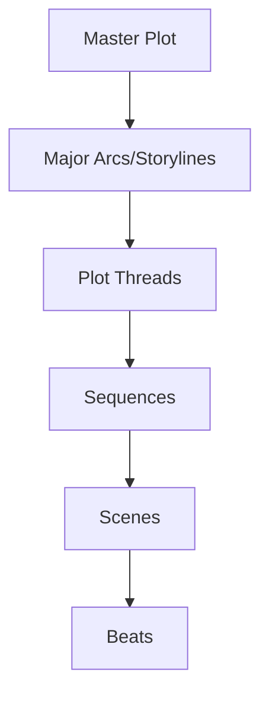
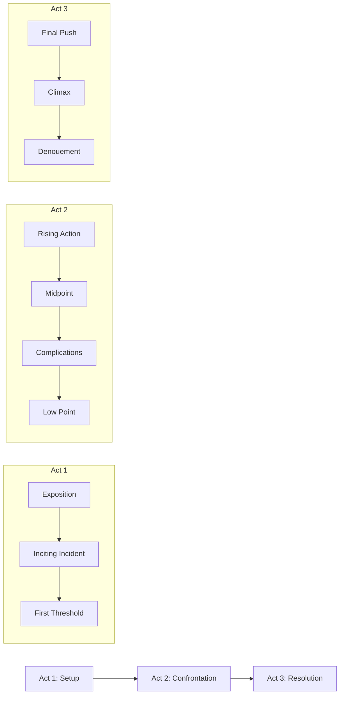

# Plot Overview

## Purpose
This document establishes the framework for plot development, structure, and progression throughout the narrative project, providing guidelines for creating cohesive, engaging, and meaningful storylines.

## Classification
- **Domain:** Plot Structure
- **Stability:** Semi-stable
- **Abstraction:** Conceptual
- **Confidence:** Evolving

## Content

### Plot Development Philosophy

[Describe the overall approach to plot development for this narrative project, including the balance between planning and discovery, structural frameworks, and purpose of plot elements]

### Plot Architecture

#### Plot Scales

**Master Plot**
[Description of the overarching plot structure that encompasses the entire narrative]

**Major Arcs/Storylines**
[Description of primary storylines that constitute major segments of the overall narrative]

**Plot Threads**
[Description of specific ongoing narrative elements that weave through multiple sequences]

**Sequences**
[Description of connected scene groups that form coherent narrative units]

**Scenes**
[Description of individual dramatic units with specific purpose and structure]

**Beats**
[Description of moment-by-moment progression within scenes]

### Plot Structural Frameworks

[List and describe the plot structural frameworks applicable to this narrative project]

#### Primary Structure
[Describe the main structural framework being used (e.g., Three-Act Structure, Hero's Journey, Five-Act Structure, etc.)]

#### Alternative/Supplementary Structures
[Describe any additional structural frameworks that inform plot development]

### Plot Elements and Components

#### Conflicts
[Description of the types and layers of conflict that drive the narrative]

- **External Conflicts**
  [Description of character vs. character, character vs. nature, character vs. society, etc.]

- **Internal Conflicts**
  [Description of character vs. self conflicts]

- **Conflict Hierarchy**
  [Description of how conflicts are prioritized and layered]

#### Tension and Stakes
[Description of how tension is created, escalated, and resolved]

- **Types of Stakes**
  [Physical, emotional, moral, social, etc.]

- **Escalation Patterns**
  [How stakes increase throughout the narrative]

#### Reveals and Twists
[Description of approach to information revelation and narrative surprises]

- **Information Management**
  [How information is controlled, revealed, and withheld]

- **Twist Development**
  [Guidelines for creating effective plot twists and revelations]

#### Pacing and Rhythm
[Description of how story rhythm is controlled and varied]

- **Pacing Patterns**
  [Fast vs. slow, action vs. reflection, etc.]

- **Structural Rhythm**
  [How to create satisfying patterns of tension and release]

### Plot Development Process

1. **Concept Development**
   [Description of initial plot concept development process]

2. **Structural Planning**
   [Process for applying structural frameworks to raw plot concepts]

3. **Scene Mapping**
   [Approach to developing the scene-by-scene progression]

4. **Causal Logic Review**
   [Methods for ensuring cause-and-effect logic throughout the plot]

5. **Emotional Impact Planning**
   [Approach to designing for emotional engagement and impact]

### Plot-Narrative Integration

#### Plot-Character Integration
[Description of how plot and character development intertwine]

#### Plot-Theme Integration
[Description of how plot events and structures express thematic elements]

#### Plot-World Integration
[Description of how plot utilizes and reveals world elements]

#### Plot-Setting Integration
[Description of how settings and plot interact]

### Plot Management Tools

#### Plot Outlines
[Description of outlining approaches and formats]

#### Story Beats Documentation
[Description of beat sheet approaches]

#### Plot Thread Tracking
[Methods for tracking multiple plot elements across the narrative]

## Implementation Guidelines

### Plot Consistency Checklist
- [Consistency check 1]
- [Consistency check 2]
- [Consistency check 3]

### Plot Development Questions
- [Question to strengthen plot 1]
- [Question to strengthen plot 2]
- [Question to strengthen plot 3]

### Common Plot Issues and Solutions
- [Issue 1]: [Solution approach]
- [Issue 2]: [Solution approach]
- [Issue 3]: [Solution approach]

## Relationships
- **Parent Nodes:** [foundation/structure.md]
- **Child Nodes:** 
  - [elements/plot/arcs.md] - details - Major and minor arc structures
  - [elements/plot/events.md] - details - Key plot events
  - [elements/plot/outline.md] - implements - Detailed story outline
- **Related Nodes:** 
  - [elements/characters/overview.md] - influences - Character arcs drive and are driven by plot
  - [elements/world/overview.md] - constrains - World rules constrain plot possibilities
  - [elements/themes/overview.md] - expresses - Plot embodies and explores themes
  - [foundation/principles.md] - guided-by - Plot development follows narrative principles

## Navigation Guidance
- **Access Context:** Use this document when establishing plot frameworks or when developing plot structure
- **Common Next Steps:** After reviewing plot framework, typically explore specific plot arcs, events, or the detailed outline
- **Related Tasks:** Story structuring, scene development, pacing analysis, plot hole identification
- **Update Patterns:** This document should be updated when fundamental approaches to plot structure change

## Metadata
- **Created:** [Date]
- **Last Updated:** [Date]
- **Updated By:** [Role/Agent]

## Change History
- [Date]: Initial creation of plot overview template
