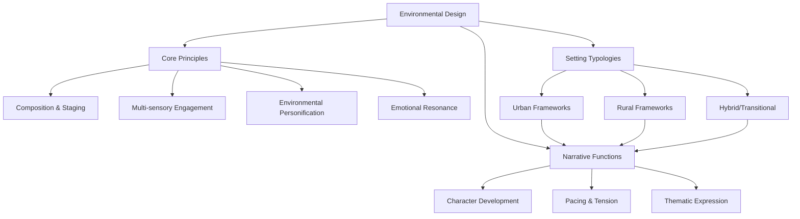

# Environmental Design Frameworks Index

## Purpose
This document serves as the main entry point for environmental design frameworks, providing navigation to specific environmental design concepts and approaches for narrative development.

## Classification
- **Domain:** Environment Design
- **Stability:** Established
- **Abstraction:** Methodological
- **Confidence:** Evidence-based

## Categories

### [Core Design Principles](core_principles/index.md)
Foundational principles that apply across all environmental design contexts, including composition & staging, multi-sensory engagement, environmental personification, and emotional resonance.

### [Urban Environmental Design Framework](urban_frameworks/index.md)
Specialized frameworks for developing urban settings within narrative contexts, including structural elements, atmospheric elements, and social elements specific to urban environments.

### [Rural Environmental Design Framework](rural_frameworks/index.md)
Specialized frameworks for developing rural settings within narrative contexts, including structural elements, atmospheric elements, and social elements specific to rural environments.

### [Impact on Narrative Elements](narrative_impact/index.md)
Analysis of how environmental design frameworks influence key narrative components including character development, pacing and tension, and thematic expression.

### [Implementation Methodology](implementation/index.md)
Practical application methodologies for these frameworks, including setting analysis, framework selection, environmental development, narrative integration, and templates for implementation.

## Overview

Environmental design in narrative contexts encompasses the deliberate crafting of settings to enhance storytelling, character development, and thematic expression. Effective environmental design functions not merely as backdrop but as an active participant in the narrative, influencing mood, pacing, character psychology, and thematic resonance.

## Recent Additions

### Environmental Design Hierarchical Organization - 2025-05-22
**Status:** Implemented

The environmental design frameworks have been reorganized into a hierarchical structure to improve navigation and management of the content. This reorganization aligns with the context network's guidelines for files exceeding certain size thresholds.

## Related Content
- [elements/world/worldbuilding_frameworks.md] - Environmental design complements worldbuilding frameworks
- [elements/plot/scene_building_frameworks.md] - Environmental design provides context for scene construction
- [elements/characters/overview.md] - Environments shape character development
- [context-network/archive/research_tasks/environmental_design_research_summary.md] - Original research that informed these frameworks

## Metadata
- **Created:** 2025-05-22
- **Last Updated:** 2025-05-22
- **Updated By:** Cline Agent

## Change History
- 2025-05-22: Created hierarchical organization from original environmental_design_frameworks.md file
