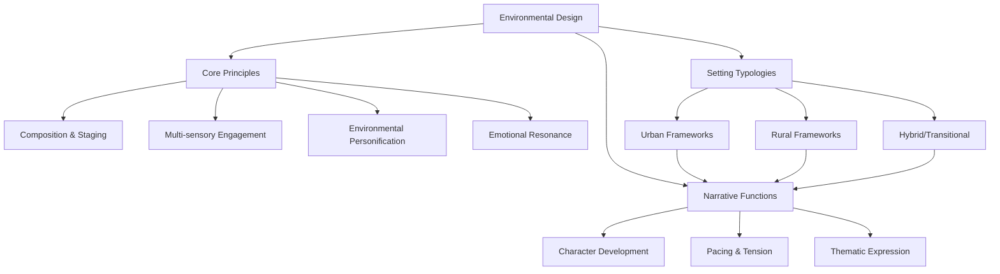

# Environmental Design Frameworks

## Purpose
This document provides specialized frameworks for developing urban and rural settings within narrative contexts, detailing how different environments shape narrative elements and offering practical guidelines for implementation.

## Classification
- **Domain:** Environment Design
- **Stability:** Established
- **Abstraction:** Methodological
- **Confidence:** Evidence-based

## Content

### Environmental Design Overview

Environmental design in narrative contexts encompasses the deliberate crafting of settings to enhance storytelling, character development, and thematic expression. Effective environmental design functions not merely as backdrop but as an active participant in the narrative, influencing mood, pacing, character psychology, and thematic resonance.

### Core Design Principles

These foundational principles apply across all environmental design contexts, regardless of setting type:

#### Composition & Staging

**Definition**: The deliberate arrangement of environmental elements to guide attention, create visual pathways, and establish narrative focus.

**Implementation Guidelines**:
1. Identify key focal points that advance narrative or reveal character
2. Create visual hierarchies that draw attention to significant elements
3. Use leading lines to guide audience through the environment
4. Establish foreground, midground, and background layers for depth
5. Position threshold elements at transition points between narrative phases

**Application Example**:
In a pivotal scene, arrange environmental elements to frame a character's moment of decision. Place symbolic objects at key sightlines, with visual pathways that suggest possible choices or outcomes.

#### Multi-sensory Engagement

**Definition**: The integration of visual, auditory, tactile, olfactory, and kinesthetic elements to create immersive environments.

**Implementation Guidelines**:
1. Develop specific sensory signatures for distinct environments
2. Layer multiple sensory inputs for memorable locations
3. Create sensory contrasts to mark transitions between settings
4. Use sensory details strategically to evoke emotional responses
5. Consider sensory absence (silence, darkness, etc.) as deliberate design elements

**Application Example**:
For a marketplace scene, develop a consistent sensory palette: visual (colorful stalls, diverse crowds), auditory (haggling, music), olfactory (spices, foods), tactile (textures of goods), and kinesthetic (navigating through crowded spaces).

#### Environmental Personification

**Definition**: The development of settings with distinct "personalities" that influence and reflect narrative elements.

**Implementation Guidelines**:
1. Define the environment's "character" with specific traits and tendencies
2. Create consistent "behavioral patterns" through environmental dynamics
3. Establish "relationships" between the environment and characters
4. Develop the environment's "arc" throughout the narrative
5. Use environmental "reactions" to character actions and decisions

**Application Example**:
A haunted house might be personified with traits like "deceptive," "resentful," and "patient," manifesting through subtle environmental changes that align with these characteristics and evolve as characters interact with the space.

#### Emotional Resonance

**Definition**: The deliberate design of environments to evoke specific emotional responses that enhance narrative impact.

**Implementation Guidelines**:
1. Identify target emotional states for key narrative moments
2. Select environmental elements known to trigger those emotions
3. Layer multiple resonant elements for stronger effect
4. Create emotional contrasts between sequential environments
5. Use contradictory elements to create emotional complexity

**Application Example**:
To evoke unease, combine high ceilings (vulnerability) with confined pathways (restriction), add subtle asymmetry to seemingly ordered elements, use sounds just at the threshold of perception, and implement lighting that creates ambiguous shadows.

### Urban Environmental Design Framework

Urban settings present unique opportunities and challenges for environmental storytelling, requiring specific design approaches:

#### Structural Elements

**Density and Verticality**

**Definition**: The concentration of structures with vertical expansion, creating layered physical and social spaces.

**Implementation Guidelines**:
1. Use vertical positioning to reflect power dynamics and social hierarchies
2. Create vertical journeys that parallel character development arcs
3. Contrast upper/lower level aesthetics to highlight societal divisions
4. Develop distinct environment dynamics at different elevations
5. Implement vertical thresholds as narrative transition points

**Application Example**:
In a cyberpunk narrative, design a megastructure where executive levels feature clean lines, abundant light, and minimalist aesthetics, while lower levels become progressively more chaotic, darker, and improvised, with transitions between levels serving as story thresholds.

**Grid Systems and Disruption**

**Definition**: The planned organization of urban spaces with deliberate interruptions that create narrative tension.

**Implementation Guidelines**:
1. Establish base grid patterns that reflect order and control
2. Create deliberate disruptions to represent resistance or history
3. Use grid navigation as a metaphor for character journeys
4. Implement grid-breaking elements to highlight exceptional entities
5. Use perspective and vantage points to reveal or hide grid patterns

**Application Example**:
Design a city district with rigid grid layout representing institutional control, then introduce an older neighborhood that predates the grid and maintains circular or organic pathways, serving as a haven for characters resisting the dominant system.

**Boundaries and Thresholds**

**Definition**: The delineation between urban districts that create natural story transition points and reflect social divisions.

**Implementation Guidelines**:
1. Design visually distinct zones separated by clear boundaries
2. Create physical barriers that represent social or psychological obstacles
3. Implement transitional spaces that blend elements from adjacent districts
4. Use checkpoint elements to mark significant narrative progressions
5. Develop boundary-crossing rituals or processes that reflect story themes

**Application Example**:
In a divided city narrative, design a checkpoint between districts that requires characters to change clothing, adopt different speech patterns, or present credentials, physically embodying the theme of identity adaptation.

#### Atmospheric Elements

**Technological Integration**

**Definition**: The embedding of technology within urban environments as both functional and symbolic elements.

**Implementation Guidelines**:
1. Determine technology visibility spectrum (overt to hidden)
2. Create technology distribution patterns that reflect social access
3. Design technological aesthetics that reinforce narrative themes
4. Use technology functionality to enable or constrain character actions
5. Implement technology failure scenarios tied to plot developments

**Application Example**:
In a surveillance state narrative, design environmental elements with embedded cameras that become progressively more visible as a character becomes more aware of being watched, with the density and obtrusiveness of surveillance technology increasing in areas of story tension.

**Sensory Density**

**Definition**: The concentration of sensory inputs creating distinctive urban experiential landscapes.

**Implementation Guidelines**:
1. Map sensory intensity zones across urban environments
2. Create sensory signatures for different districts or areas
3. Design sensory overload points tied to narrative tension
4. Implement sensory relief spaces for character and audience processing
5. Use sensory contrast between sequential environments for emphasis

**Application Example**:
Design a progression through a city where characters move from a quiet residential area through increasingly sensory-dense environments (commercial, entertainment, industrial) with each transition marking a new phase of the story and increasing tension.

**Artificial Lighting**

**Definition**: The deliberate manipulation of light sources to create mood, guide attention, and establish temporal context.

**Implementation Guidelines**:
1. Create lighting signatures for different urban zones
2. Design lighting transitions to mark time passage
3. Use lighting contrast to highlight social disparities
4. Implement lighting failure scenarios tied to plot developments
5. Design shadow patterns that reveal or conceal environmental elements

**Application Example**:
In a noir-influenced narrative, create distinct lighting approaches for different character territories: harsh fluorescents for bureaucratic spaces, warm incandescent lighting for safe havens, neon for morally ambiguous zones, and deep shadows for areas of danger.

#### Social Elements

**Crowds and Anonymity**

**Definition**: The presence or absence of dense human activity as a narrative element.

**Implementation Guidelines**:
1. Map crowd density patterns across environments
2. Design crowd behavior patterns that reflect local social norms
3. Create crowd composition variations that characterize different areas
4. Use crowd absence in normally busy areas as tension indicator
5. Implement crowd movement dynamics that facilitate or obstruct character goals

**Application Example**:
Design a public square where crowd density and behavior shifts based on narrative events—from casual mingling during normal scenes to unified attention during public announcements to panic movement during crisis moments.

**Social Friction Points**

**Definition**: Locations where different social groups interact, creating natural settings for conflict and character development.

**Implementation Guidelines**:
1. Identify boundary zones between different social territories
2. Design shared resources that draw diverse characters together
3. Create environments with contested usage or meaning
4. Implement visual cues of territorial marking and counter-marking
5. Design spaces that require negotiation of different behavioral codes

**Application Example**:
Create a public market where wealthy customers, middleclass merchants, and struggling service workers interact within a space that has different meanings and functions for each group, with design elements that highlight these distinctions.

**Visible Infrastructure**

**Definition**: The physical manifestation of societal systems that reveal power structures and organizational principles.

**Implementation Guidelines**:
1. Design infrastructure elements that represent governing ideologies
2. Create infrastructure accessibility patterns that reflect social hierarchy
3. Implement infrastructure failure scenarios tied to narrative conflicts
4. Use infrastructure maintenance states to indicate area prosperity or neglect
5. Design alternatives or modifications that represent resistance or adaptation

**Application Example**:
In a dystopian narrative, design water distribution infrastructure that becomes progressively more improvised and deteriorated as social status decreases, with elite areas featuring ornate fountains, middle areas having functional but utilitarian access, and lower areas showing jury-rigged connections and collective distribution points.

### Rural Environmental Design Framework

Rural settings employ different design principles to establish their narrative environments:

#### Structural Elements

**Expansiveness and Horizontality**

**Definition**: The emphasis on open spaces and horizontal landscapes creating distinctive spatial experiences.

**Implementation Guidelines**:
1. Use horizon line positioning to establish emotional context
2. Design distance-revealing vantage points tied to character perspective shifts
3. Create scale contrasts between human elements and landscape
4. Use negative space as active compositional element
5. Implement visibility dynamics that reveal or conceal distant elements

**Application Example**:
Design a rural landscape where a character's emotional journey is reflected in their relationship to the horizon—initially appearing trapped by endless open space, then gradually finding comfort and possibility in the same vista.

**Negative Space**

**Definition**: The strategic use of emptiness and distance as active narrative elements.

**Implementation Guidelines**:
1. Map areas where absence is more significant than presence
2. Design journeys where distance itself becomes a character challenge
3. Create visual compositions where negative space directs attention
4. Use emptiness variation to indicate environmental hostility or welcome
5. Implement isolation degrees that parallel character development

**Application Example**:
Design a character's homestead where the surrounding emptiness initially represents isolation and vulnerability, then gradually transforms to represent freedom and possibility as the character develops.

**Natural Boundaries**

**Definition**: Geographic features that create divisions and thresholds within rural environments.

**Implementation Guidelines**:
1. Select boundary features appropriate to the region (rivers, mountains, forests)
2. Design crossing points that serve as narrative thresholds
3. Create boundary dynamics that change with seasons or conditions
4. Use boundaries to separate different social or narrative territories
5. Implement boundary permeability that reflects story themes

**Application Example**:
Design a river boundary that separates two communities, with crossing difficulty varying seasonally, crossing methods reflecting character resources and abilities, and crossing moments aligned with key character decisions or transformations.

#### Atmospheric Elements

**Natural Integration**

**Definition**: The prominent role of natural elements in shaping narrative and character experiences.

**Implementation Guidelines**:
1. Identify signature natural elements for the specific environment
2. Design natural element behaviors that parallel plot developments
3. Create character-nature interaction patterns that reveal character traits
4. Use natural element states to establish emotional context
5. Implement natural resources as drivers of character motivation and conflict

**Application Example**:
In an agricultural community setting, design crop growth patterns that parallel the protagonist's development arc, with planting, tending, threat, and harvest phases aligned with character challenges and growth.

**Diurnal and Seasonal Cycles**

**Definition**: The emphasis on natural time patterns as narrative structuring elements.

**Implementation Guidelines**:
1. Map narrative events to appropriate diurnal and seasonal periods
2. Design environment transformations that mark time passage
3. Create activity patterns tied to natural time cycles
4. Use cycle disruptions as tension or crisis indicators
5. Implement seasonal transitions as narrative phase markers

**Application Example**:
Structure a coming-of-age narrative around the seasonal cycle, with character challenges intensifying through winter hardship, internal development during spring renewal, external testing in summer abundance, and resolution/harvest in autumn.

**Organic Soundscapes**

**Definition**: The distinctive acoustic environment of rural settings used for narrative enhancement.

**Implementation Guidelines**:
1. Create signature sound profiles for different rural environments
2. Design sound pattern variations tied to weather and time conditions
3. Use sound presence or absence as emotional cue
4. Implement sound intrusions that indicate boundary crossings
5. Design sound gradients that mark transitions between zones

**Application Example**:
Develop a sound design approach where natural sounds (birds, insects, wind) gradually diminish as a character approaches a location with supernatural properties, with silence depth indicating proximity to the anomalous zone.

#### Social Elements

**Historical Continuity**

**Definition**: The visible presence of multiple time periods within rural environments.

**Implementation Guidelines**:
1. Layer structures and features from different historical periods
2. Design usage patterns that show adaptation of historical elements
3. Create maintenance variations that reflect value placed on heritage
4. Use historical element clustering to indicate community longevity
5. Implement historical markers that provide narrative backstory

**Application Example**:
Design a rural community center with visible building elements from multiple eras—foundation stones from original settlement, main structure from prosperity period, modern additions for contemporary needs—each layer revealing community history and values.

**Simplicity and Authenticity**

**Definition**: The emphasis on functional design, traditional materials, and visible craftsmanship.

**Implementation Guidelines**:
1. Design elements that reveal their function through form
2. Create material palettes authentic to the region and period
3. Use craftsmanship quality as indicator of character traits
4. Implement improvisation elements that show adaptation to conditions
5. Design durability variations that reflect resource access

**Application Example**:
In a homesteading narrative, design character dwellings where construction methods, material choices, and maintenance approaches directly reflect each character's values, resources, and relationship to tradition.

**Community Visibility**

**Definition**: The physical manifestation of community relationships through environmental design.

**Implementation Guidelines**:
1. Design common spaces that reveal community priorities
2. Create property boundary treatments that show relationship types
3. Use resource sharing systems that demonstrate community values
4. Implement gathering point hierarchy to show social organization
5. Design mutual aid elements that reveal interdependence

**Application Example**:
Create a rural community layout where house positioning, shared resource structures (wells, mills), pathways between properties, and central gathering spaces physically embody the social connections and dependencies among characters.

### Impact on Narrative Elements

The environmental design frameworks significantly influence key narrative components:

#### Character Development

**Urban Character Development Framework**

The urban environment shapes character through:

1. **Identity Formation**: Characters define themselves through professional roles, social positioning, and relationship to urban systems rather than family heritage or land connection.

2. **Social Navigation**: Character growth occurs through learning to navigate complex social hierarchies and anonymous interactions, developing skills in reading social cues with limited context.

3. **Proximity without Intimacy**: Character tensions arise from physical closeness combined with emotional distance, creating paradoxical isolation within crowds.

4. **Adaptation Demands**: Characters must continually evolve in response to technological change, social trends, and shifting neighborhood dynamics.

5. **Specialized Knowledge**: Characters develop deep expertise in narrow domains, often lacking self-sufficiency but possessing valuable specialized skills.

**Rural Character Development Framework**

The rural environment shapes character through:

1. **Identity Formation**: Characters define themselves through relationship to land, community role, family legacy, and generational continuity.

2. **Environmental Response**: Character growth occurs through confrontation with natural elements, isolation challenges, and seasonal demands.

3. **Intimacy without Privacy**: Character tensions arise from deep knowledge of others combined with limited personal privacy, creating complex community dynamics.

4. **Tradition Negotiation**: Characters must navigate between preserving valuable traditions and adapting to necessary changes.

5. **Self-Sufficiency**: Characters develop broad practical skill sets and resourcefulness, valuing versatility over specialization.

#### Pacing and Tension

**Urban Pacing Framework**

Urban environments naturally structure narrative pacing through:

1. **Density-Driven Acceleration**: Multiple simultaneous events and dense interactions create opportunities for rapid pacing and complex parallel storylines.

2. **Privacy Dynamics**: Tension arises through threatened privacy or unwanted exposure in environments where observation is constant but attention is limited.

3. **Space Competition**: Conflict naturally emerges from competing interests for limited physical space, creating inherent antagonism.

4. **System Vulnerabilities**: Crisis moments occur through infrastructure failures (power outages, transit strikes, water main breaks) that disrupt normal urban functioning.

5. **District Transitions**: Story phases are marked by physical movement between distinct urban zones with contrasting atmospheres and social rules.

**Rural Pacing Framework**

Rural environments structure narrative pacing through:

1. **Natural Rhythm Alignment**: Extended timing with emphasis on diurnal, lunar, and seasonal cycles creates natural story beats and progression markers.

2. **Isolation Dynamics**: Tension arises through physical separation, communication limitations, or resource scarcity during challenging periods.

3. **Resource Stewardship**: Conflict emerges from competing approaches to limited resource management or resistance to changing traditions.

4. **Environmental Vulnerability**: Crisis moments occur through natural events (storms, floods, droughts) that threaten character safety or livelihood.

5. **Gradual Transitions**: Story phases are marked by environmental transformations (seasonal changes, crop cycles, animal migrations) that occur at nature's pace.

#### Thematic Expression

**Urban Thematic Framework**

Urban environments naturally embody certain thematic tensions:

1. **Progress vs. Tradition**: The constant renovation and replacement of urban structures physically manifests the tension between innovation and heritage.

2. **Individual vs. Collective**: Urban design elements like public spaces versus private buildings embody the balance between personal and communal priorities.

3. **Privacy vs. Surveillance**: The visual accessibility of urban life creates inherent questions about observation, privacy rights, and social monitoring.

4. **Efficiency vs. Humanity**: Urban systems designed for maximum efficiency often create friction with human needs for connection and meaning.

5. **Innovation vs. Stability**: The urban landscape physically displays the tension between creative destruction and comforting continuity.

**Rural Thematic Framework**

Rural environments naturally embody different thematic tensions:

1. **Nature vs. Civilization**: The visible interface between wild and cultivated areas physically represents humanity's relationship with natural systems.

2. **Permanence vs. Change**: Rural landscapes show both enduring features (geological formations, ancient trees) and cyclical transformations (seasons, growth cycles).

3. **Community vs. Isolation**: The physical spacing of dwellings and gathering places embodies the balance between connection and solitude.

4. **Heritage vs. Adaptation**: The presence of traditional methods alongside modern innovations physically represents the negotiation between inherited wisdom and progress.

5. **Simplicity vs. Complexity**: Rural designs often demonstrate the tension between minimalist functionality and the complex understanding required to work with natural systems.

### Implementation Methodology

For practical application of these frameworks, follow this implementation process:

#### 1. Setting Analysis

1. **Setting Classification**: Determine whether the primary setting is urban, rural, or a hybrid environment.

2. **Narrative Requirements Assessment**: Identify key narrative elements that the environment must support or enhance.

3. **Thematic Alignment**: Determine which environmental elements will best embody core thematic tensions.

4. **Character Integration**: Identify how character arcs will interact with environmental features.

5. **Emotional Mapping**: Create a map of desired emotional responses throughout the narrative.

#### 2. Framework Selection

1. **Primary Framework Identification**: Select the appropriate general framework (urban or rural) for the main setting.

2. **Sub-element Prioritization**: Identify which specific elements within the framework are most relevant to narrative goals.

3. **Hybrid Approach (if applicable)**: For settings with mixed characteristics, determine which elements from each framework to incorporate.

4. **Contrast Elements**: If using multiple settings, identify complementary or contrasting elements from different frameworks.

5. **Character-Environment Matching**: Select environmental elements that best reflect or challenge character traits.

#### 3. Environmental Development

1. **Structural Foundation**: Establish the fundamental physical characteristics of the environment.

2. **Atmospheric Layering**: Add sensory and emotional dimensions to the physical foundation.

3. **Social Integration**: Incorporate elements that reflect social dynamics and community characteristics.

4. **Historical Contextualization**: Develop the environment's past to explain its current state.

5. **Dynamic Factors**: Identify how the environment will change throughout the narrative.

#### 4. Narrative Integration

1. **Scene Setting Alignment**: For each scene, identify which environmental elements will be emphasized.

2. **Transition Design**: Create environmental shifts that reinforce narrative transitions.

3. **Character-Environment Interactions**: Design specific ways characters will interact with environmental features.

4. **Environmental Obstacles**: Develop environment-based challenges that advance the plot.

5. **Environmental Revelations**: Create moments where environment reveals important narrative information.

#### 5. Review and Refinement

1. **Consistency Check**: Ensure environmental elements remain consistent unless changes are narratively justified.

2. **Sensory Completion**: Verify that all sensory aspects of the environment have been addressed.

3. **Thematic Reinforcement**: Confirm that environmental elements properly support thematic goals.

4. **Character Impact**: Assess how effectively the environment influences character development.

5. **Audience Experience**: Consider how the audience will perceive and engage with the environment.

### Application Templates

#### Urban Setting Development Template

**Core Characteristics**
- Setting Name:
- Urban Type (metropolis, small city, district, etc.):
- Time Period:
- Primary Function (residential, commercial, industrial, etc.):
- Distinctive Features:

**Structural Elements**
- Density Pattern:
- Vertical Organization:
- Grid Structure and Disruptions:
- Key Boundaries and Thresholds:
- Architectural Signature:

**Atmospheric Elements**
- Technology Level and Integration:
- Sensory Profile (sounds, smells, tactile qualities):
- Lighting Characteristics:
- Weather and Climate Factors:
- Time Cycle Indicators:

**Social Elements**
- Population Characteristics:
- Social Group Interactions:
- Visible Infrastructure:
- Economic Indicators:
- Authority Representation:

**Narrative Functions**
- Character Development Support:
- Thematic Elements Embodied:
- Plot Functions:
- Emotional Atmosphere:
- Transformations Through Story:

#### Rural Setting Development Template

**Core Characteristics**
- Setting Name:
- Rural Type (agricultural, wilderness, village, etc.):
- Time Period:
- Primary Function (farming, extraction, recreation, etc.):
- Distinctive Features:

**Structural Elements**
- Landscape Profile:
- Spatial Organization:
- Natural Boundaries:
- Built Structure Pattern:
- Natural Feature Signature:

**Atmospheric Elements**
- Natural Integration Level:
- Sensory Profile (sounds, smells, tactile qualities):
- Seasonal Importance:
- Weather and Climate Factors:
- Diurnal Cycle Significance:

**Social Elements**
- Community Characteristics:
- Historical Continuity Markers:
- Shared Resource Systems:
- Craftsmanship Elements:
- Tradition Indicators:

**Narrative Functions**
- Character Development Support:
- Thematic Elements Embodied:
- Plot Functions:
- Emotional Atmosphere:
- Transformations Through Story:

### Environmental Design Checklists

#### Urban Environment Checklist

**Structure Completeness**
- [ ] Vertical organization defined
- [ ] District boundaries established
- [ ] Grid pattern and variations identified
- [ ] Key thresholds positioned
- [ ] Infrastructure systems developed

**Atmosphere Development**
- [ ] Sensory profiles created for each zone
- [ ] Lighting approach established
- [ ] Technology integration determined
- [ ] Climate effects incorporated
- [ ] Background sounds defined

**Social Integration**
- [ ] Population patterns established
- [ ] Authority representation designed
- [ ] Economic indicators incorporated
- [ ] Social friction points identified
- [ ] Community gathering locations positioned

**Narrative Functionality**
- [ ] Environment supports required scenes
- [ ] Setting creates appropriate obstacles
- [ ] Atmosphere reinforces emotional tone
- [ ] Elements align with thematic goals
- [ ] Setting enables character development

#### Rural Environment Checklist

**Structure Completeness**
- [ ] Landscape features defined
- [ ] Natural boundaries established
- [ ] Settlement pattern determined
- [ ] Resource locations identified
- [ ] Movement pathways developed

**Atmosphere Development**
- [ ] Seasonal effects determined
- [ ] Natural element behaviors established
- [ ] Sensory profiles created
- [ ] Weather patterns incorporated
- [ ] Time cycle indicators defined

**Social Integration**
- [ ] Community organization reflected
- [ ] Historical elements incorporated
- [ ] Shared resource systems designed
- [ ] Tradition indicators positioned
- [ ] Craftsmanship elements included

**Narrative Functionality**
- [ ] Environment supports required scenes
- [ ] Setting creates appropriate obstacles
- [ ] Atmosphere reinforces emotional tone
- [ ] Elements align with thematic goals
- [ ] Setting enables character development

## Relationships
- **Parent Nodes:** 
  - [elements/settings/overview.md] - implements - Provides specific frameworks for setting development
  - [context-network/archive/research_tasks/environmental_design_research_summary.md] - derives-from - Implements research findings
- **Child Nodes:** 
  - [future files for specific setting implementations]
- **Related Nodes:** 
  - [elements/world/worldbuilding_frameworks.md] - complements - Environmental design works with worldbuilding frameworks
  - [elements/plot/scene_building_frameworks.md] - enhances - Environmental design provides context for scene construction
  - [elements/characters/overview.md] - influences - Environments shape character development

## Navigation Guidance
- **Access Context:** Use this document when designing narrative environments, particularly when deciding between urban and rural approaches for specific settings
- **Common Next Steps:** After reviewing these frameworks, typically proceed to applying them to specific settings or integrating them with scene construction
- **Related Tasks:** Setting development, environmental storytelling, narrative atmosphere creation, scene design
- **Update Patterns:** This document should be updated when new environmental design approaches are identified or existing frameworks are refined

## Metadata
- **Created:** 2025-05-21
- **Last Updated:** 2025-05-21
- **Updated By:** Cline Agent

## Change History
- 2025-05-21: Initial creation of environmental design frameworks document
