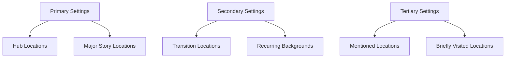

# Settings Overview

## Purpose
This document provides a framework for developing, documenting, and implementing specific locations and environments within the narrative world, establishing their physical characteristics, emotional resonance, and narrative functions.

## Classification
- **Domain:** Environment Design
- **Stability:** Semi-stable
- **Abstraction:** Structural
- **Confidence:** Evolving

## Content

### Setting Development Philosophy

[Describe the overall approach to setting development for this narrative project, including the balance between detail and suggestion, sensory design principles, and narrative integration of environments]

### Setting Categories

#### Primary Settings
[Description of locations where significant narrative time is spent, including development depth requirements and integration with plot]

#### Secondary Settings
[Description of locations that appear multiple times but with less narrative weight, including development approach]

#### Tertiary Settings
[Description of locations briefly visited or mentioned, including efficient development techniques]

### Setting Components

#### Physical Characteristics

**Environmental Features**
- Geography and topography
- Climate and weather patterns
- Natural features and hazards
- Ecological elements

**Constructed Elements**
- Architecture and design
- Infrastructure and technology
- Artificial boundaries and structures
- Manufactured objects and artifacts

**Sensory Landscape**
- Visual elements (light, color, texture)
- Sounds and acoustics
- Smells and tastes
- Tactile sensations
- Environmental kinesthetics

#### Cultural Integration

**Social Context**
- Power structures visible in environment
- Economic indicators
- Cultural symbols and practices
- Territorial markers

**Historical Layering**
- Age and weathering indicators
- Historical events visible in setting
- Evolution and adaptation markers
- Preservation and restoration elements

#### Emotional Design

**Mood Engineering**
- Atmosphere and emotional tone
- Comfort/discomfort factors
- Safety/danger indicators
- Familiarity/alienation balance

**Psychological Impact**
- Cognitive responses triggered
- Emotional associations
- Symbolic resonance
- Character perception filters

### Setting Functions

#### Narrative Functions

**Plot Support**
[How settings enable or constrain plot events]

**Character Reflection**
[How settings reflect or contrast with character traits]

**Thematic Reinforcement**
[How settings embody or explore thematic elements]

**World Embodiment**
[How specific settings instantiate broader world principles]

#### Dramatic Functions

**Conflict Enhancement**
[How settings heighten or complicate conflicts]

**Background-Foreground Relationship**
[How settings interact with action in foreground]

**Mood Establishment**
[How settings create emotional context for scenes]

**Transitional Roles**
[How settings function as transitions between story phases]

### Setting Development Process

1. **Concept Development**
   [Description of initial setting concept development]

2. **Narrative Integration**
   [Process for ensuring setting serves story needs]

3. **Detail Layering**
   [Approach to developing setting depth through selected details]

4. **Sensory Design**
   [Methods for creating multi-sensory environmental experiences]

5. **Map and Spatial Logic**
   [Process for ensuring spatial consistency and logic]

### Setting Implementation Techniques

#### Description Strategies

**Focal Point Method**
[Description of highlighting key environmental elements]

**Character Perception Filter**
[Description of showing environment through character perspective]

**Dynamic Description**
[Description of integrating setting details with action]

**Environmental Storytelling**
[Description of using setting to imply narrative]

#### Setting Management Tools

**Setting Sheets**
[Description of setting documentation approach]

**Sensory Palette**
[Description of defining sensory characteristics]

**Location Maps**
[Description of spatial relationship documentation]

**Setting-Plot Integration Chart**
[Description of tracking setting usage across narrative]

## Implementation Guidelines

### Setting Consistency Checklist
- [Consistency check 1]
- [Consistency check 2]
- [Consistency check 3]

### Setting Development Questions
- [Question to deepen setting 1]
- [Question to deepen setting 2]
- [Question to deepen setting 3]

### Common Setting Issues and Solutions
- [Issue 1]: [Solution approach]
- [Issue 2]: [Solution approach]
- [Issue 3]: [Solution approach]

## Relationships
- **Parent Nodes:** [foundation/structure.md]
- **Child Nodes:** 
  - [elements/settings/locations/] - details - Specific location profiles
  - [elements/settings/maps.md] - visualizes - Spatial relationships
  - [elements/settings/descriptions.md] - implements - Standard setting descriptions
- **Related Nodes:** 
  - [elements/world/overview.md] - instantiates - Settings implement world concepts
  - [elements/plot/events.md] - hosts - Settings host plot events
  - [elements/themes/overview.md] - embodies - Settings embody thematic elements
  - [foundation/principles.md] - guided-by - Setting development follows narrative principles

## Navigation Guidance
- **Access Context:** Use this document when establishing setting design approaches or when developing environmental elements
- **Common Next Steps:** After reviewing setting framework, typically explore specific locations, maps, or description guidelines
- **Related Tasks:** Location design, environmental storytelling, spatial relationship mapping, setting consistency checking
- **Update Patterns:** This document should be updated when fundamental approaches to setting development change

## Metadata
- **Created:** [Date]
- **Last Updated:** [Date]
- **Updated By:** [Role/Agent]

## Change History
- [Date]: Initial creation of settings overview template
