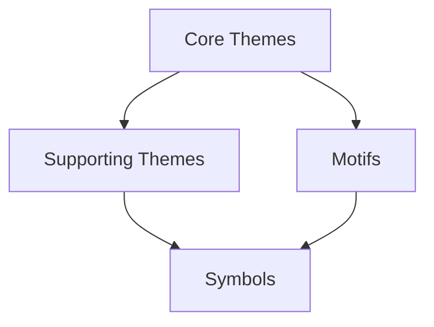

# Themes Overview

## Purpose
This document establishes the framework for thematic development throughout the narrative project, providing guidelines for identifying, exploring, and integrating meaningful themes that add depth and resonance to the story.

## Classification
- **Domain:** Thematic Development
- **Stability:** Semi-stable
- **Abstraction:** Conceptual
- **Confidence:** Evolving

## Content

### Thematic Development Philosophy

[Describe the overall approach to thematic development for this narrative project, including the balance between explicit and implicit themes, thematic depth, and integration with narrative elements]

### Thematic Structure

#### Core Themes
[Description of primary thematic concerns that form the philosophical foundation of the narrative]

#### Supporting Themes
[Description of secondary thematic elements that complement or contrast with core themes]

#### Motifs
[Description of recurring elements, concepts, or patterns that reinforce thematic content]

#### Symbols
[Description of concrete objects, actions, or images that represent abstract concepts]

### Thematic Expression Frameworks

#### Thematic Statements
[Describe methods for articulating clear thematic statements that guide narrative development]

**Premise Development**
[Description of how to develop and refine thematic premises]

**Thematic Questions**
[Description of framing themes as questions to be explored]

**Thematic Spectrum**
[Description of presenting themes as spectrums of competing values or ideas]

#### Thematic Development Patterns

**Setup-Exploration-Resolution**
[Description of introducing, examining, and concluding thematic elements]

**Contrast and Comparison**
[Description of exploring themes through opposing viewpoints]

**Escalating Complexity**
[Description of developing themes from simple to complex manifestations]

**Iteration and Variation**
[Description of revisiting themes in different contexts]

### Thematic Integration

#### Theme-Character Integration

**Character as Thematic Agents**
[Description of how characters embody, challenge, or evolve in relation to themes]

**Character Viewpoints on Themes**
[Description of using multiple characters to present different perspectives on themes]

**Character Arcs as Thematic Journeys**
[Description of designing character development around thematic exploration]

#### Theme-Plot Integration

**Plot Events as Thematic Tests**
[Description of designing plot points to challenge or reinforce thematic ideas]

**Thematic Turning Points**
[Description of major plot developments that shift thematic understanding]

**Resolution as Thematic Statement**
[Description of how narrative conclusions express thematic positions]

#### Theme-World Integration

**World as Thematic Canvas**
[Description of how worldbuilding elements can embody thematic concerns]

**Cultural Values as Thematic Expression**
[Description of using fictional cultures to explore thematic ideas]

**Environmental Thematics**
[Description of using setting and environment to reinforce themes]

### Thematic Development Techniques

#### Thematic Mapping

**Theme Tracking Chart**
[Description of tools to track thematic development across narrative]

**Character-Theme Matrix**
[Description of mapping themes to character perspectives]

**Scene-Theme Integration**
[Description of ensuring thematic relevance in individual scenes]

#### Balance Considerations

**Subtlety vs. Clarity**
[Guidelines for determining appropriate thematic explicitness]

**Consistency vs. Complexity**
[Guidelines for maintaining coherence while exploring nuance]

**Unity vs. Diversity**
[Guidelines for balancing focused theme exploration with thematic range]

### Thematic Implementation Tools

#### Symbol Systems
[Description of developing coherent networks of symbolic elements]

#### Dialogue Techniques
[Description of incorporating thematic content in character speech]

#### Visual/Sensory Thematics
[Description of expressing themes through sensory details]

#### Narrative Point-of-View Considerations
[Description of how narrative perspective affects thematic presentation]

## Implementation Guidelines

### Thematic Consistency Checklist
- [Consistency check 1]
- [Consistency check 2]
- [Consistency check 3]

### Thematic Development Questions
- [Question to deepen thematic exploration 1]
- [Question to deepen thematic exploration 2]
- [Question to deepen thematic exploration 3]

### Common Thematic Issues and Solutions
- [Issue 1]: [Solution approach]
- [Issue 2]: [Solution approach]
- [Issue 3]: [Solution approach]

## Relationships
- **Parent Nodes:** [foundation/structure.md]
- **Child Nodes:** 
  - [elements/themes/symbols.md] - details - Symbol systems and usage
  - [elements/themes/progressions.md] - details - Thematic development patterns
- **Related Nodes:** 
  - [elements/characters/overview.md] - embodies - Characters express thematic elements
  - [elements/plot/overview.md] - explores - Plot explores thematic questions
  - [elements/world/overview.md] - reflects - World elements reflect thematic concerns
  - [foundation/principles.md] - guided-by - Thematic development follows narrative principles

## Navigation Guidance
- **Access Context:** Use this document when establishing thematic frameworks or when developing thematic content
- **Common Next Steps:** After reviewing thematic framework, typically explore symbol systems or specific thematic progressions
- **Related Tasks:** Theme identification, symbolic development, thematic consistency checking, meaningful messaging
- **Update Patterns:** This document should be updated when fundamental approaches to thematic development change

## Metadata
- **Created:** [Date]
- **Last Updated:** [Date]
- **Updated By:** [Role/Agent]

## Change History
- [Date]: Initial creation of themes overview template
