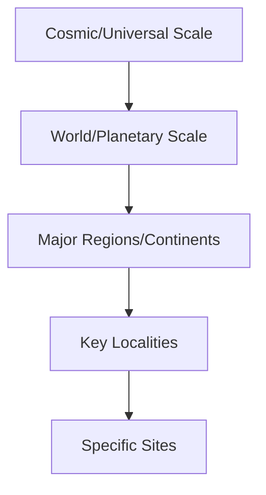

# World Overview

## Purpose
This document provides a high-level overview of the world/setting framework for the narrative project, establishing the foundational elements of the universe in which the story takes place.

## Classification
- **Domain:** Worldbuilding
- **Stability:** Semi-stable
- **Abstraction:** Conceptual
- **Confidence:** Evolving

## Content

### World Concept

[Provide a concise overview of the world/universe in which the narrative takes place, including its defining characteristics and unique elements]

### Fundamental Nature

#### Physical Laws and Constants
[Description of how the world functions physically - natural laws, deviations from our reality, magical systems, technological frameworks, etc.]

#### Metaphysical Framework
[Description of spiritual, supernatural, or philosophical underpinnings of the world, if applicable]

#### Temporal Setting
[Description of the time period, historical era, or future projection in which the narrative occurs]

### World Scale and Scope

[Description of the geographical, temporal, and conceptual boundaries of the narrative world]

### Historical Framework

#### Creation/Origin
[Brief description of how the world came to be]

#### Historical Epochs
[Overview of major historical periods relevant to the narrative]

#### Defining Events
[Description of world-shaping events that impact the current state of the world]

#### Historical Trajectory
[Overview of the historical direction - ascendant, declining, cyclical, etc.]

### Cultural Framework

#### Major Cultural Groups
[Overview of the primary cultures, societies, species, or factions]

#### Power Structures
[Description of how power, governance, and authority function]

#### Belief Systems
[Overview of religions, philosophies, and value systems]

#### Economic Systems
[Description of how resources are produced, distributed, and consumed]

### Distinctive Features

#### Unique Elements
[Description of aspects that make this world distinctive from others in its genre]

#### Iconic Imagery
[Description of visual elements that define the world's aesthetic]

#### Sensory Landscape
[Description of how the world feels, sounds, smells - its sensory identity]

### Worldbuilding Approach

#### Level of Detail
[Description of the depth and breadth of worldbuilding required]

#### Known vs. Unknown
[Approach to mysteries, unexplained elements, and deliberate gaps]

#### Research Requirements
[Areas requiring specific research or reference to develop effectively]

### Narrative Implications

#### World-Character Relationship
[How the world shapes and is shaped by its inhabitants]

#### World-Plot Relationship
[How the world enables, constrains, or directs the narrative possibilities]

#### World-Theme Relationship
[How the world embodifies or explores the narrative's themes]

## Integration Guidelines

### World Consistency Checklist
- [Consistency check 1]
- [Consistency check 2]
- [Consistency check 3]

### World Development Questions
- [Question to expand worldbuilding 1]
- [Question to expand worldbuilding 2]
- [Question to expand worldbuilding 3]

### World Implementation Process
1. [Step 1 in implementing world details]
2. [Step 2 in implementing world details]
3. [Step 3 in implementing world details]

## Relationships
- **Parent Nodes:** [foundation/structure.md]
- **Child Nodes:** 
  - [elements/world/history.md] - details - Historical timeline and events
  - [elements/world/rules.md] - specifies - Physical and metaphysical laws
  - [elements/world/cultures.md] - describes - Cultural groups and dynamics
- **Related Nodes:** 
  - [elements/settings/overview.md] - instantiates - Specific locations within the world
  - [elements/characters/overview.md] - inhabits - Characters exist within this world framework
  - [foundation/principles.md] - guided-by - World development follows narrative principles

## Navigation Guidance
- **Access Context:** Use this document when establishing the fundamental nature of the narrative world or when checking world-level consistency
- **Common Next Steps:** After reviewing the world overview, typically explore specific aspects like history, cultures, or settings
- **Related Tasks:** World development, setting creation, consistency checking, background establishment
- **Update Patterns:** This document should be updated when fundamental aspects of the world concept change

## Metadata
- **Created:** [Date]
- **Last Updated:** [Date]
- **Updated By:** [Role/Agent]

## Change History
- [Date]: Initial creation of world overview template
