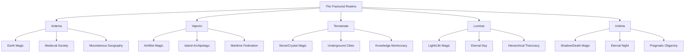
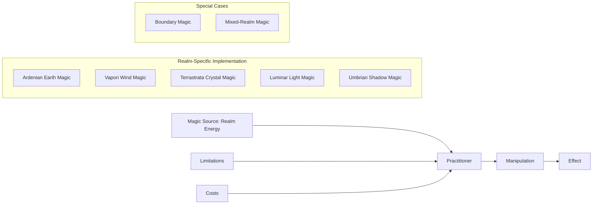
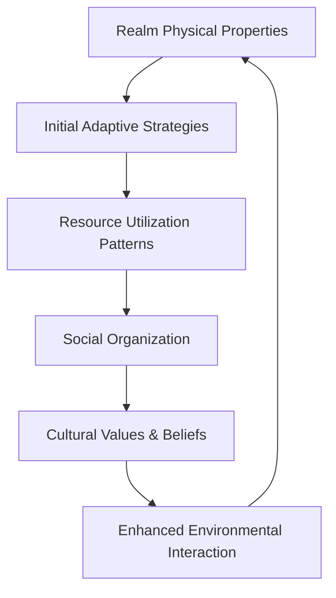
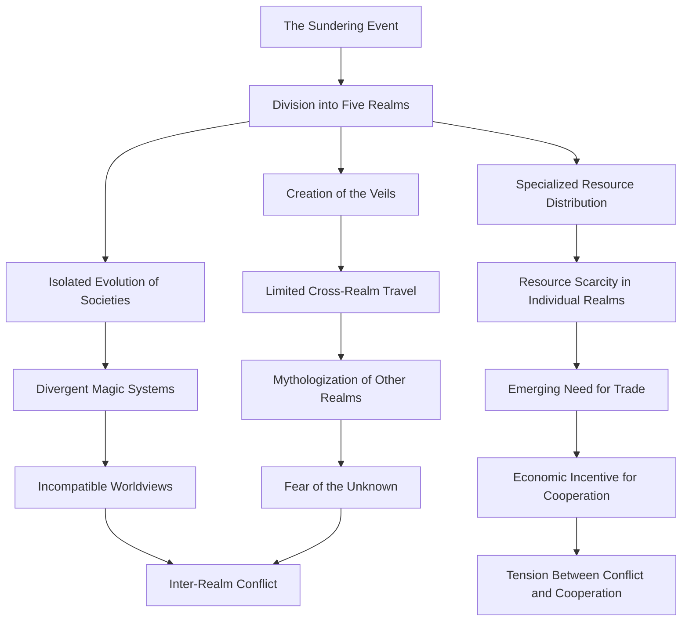
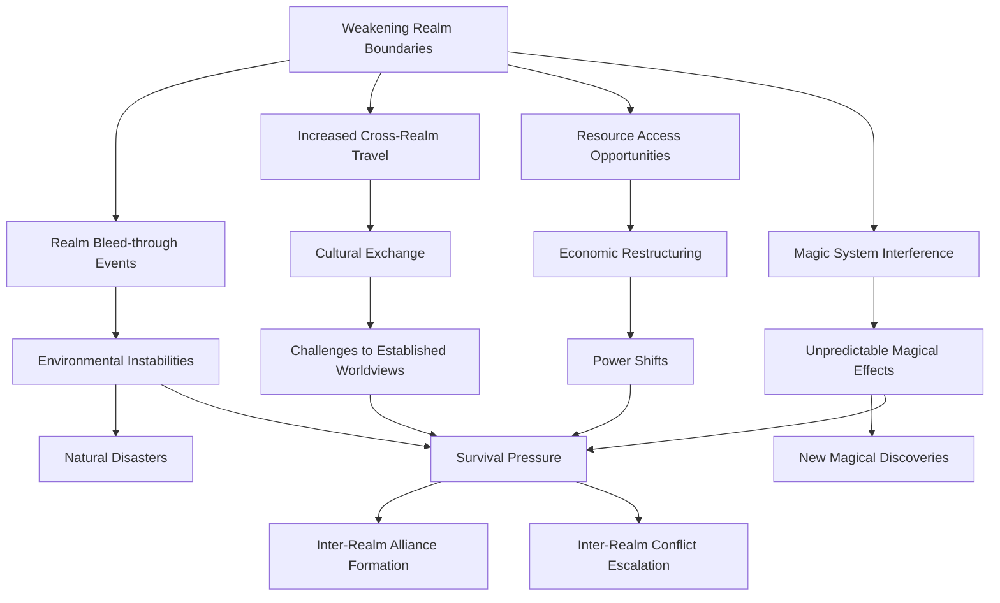

# World Overview: The Fractured Realms

## Purpose
This document provides the foundational worldbuilding for "The Fractured Realms" fantasy novel, applying appropriate frameworks from the narrative context network to create a cohesive, distinctive fantasy setting.

## Classification
- **Domain:** Worldbuilding
- **Stability:** Semi-stable
- **Abstraction:** Conceptual/Structural
- **Confidence:** Evolving

## Content

### Core World Concept

The world of The Fractured Realms was once a unified reality that shattered into five distinct realms following an ancient cataclysm known as the Sundering. Each realm operates under different physical and magical laws, with boundaries between them maintained by the Veils—semi-permeable barriers that have kept the realms isolated for centuries. Now these boundaries are weakening, causing unprecedented interactions and conflicts between realms that have evolved in isolation.

### Applied Frameworks

This worldbuilding applies the following frameworks from the narrative context network:

1. **GRAPES Framework** (Geography, Religion, Achievement, Politics, Economics, Social Structure)
2. **Magic System Development Framework**
3. **Cultural Development Framework**
4. **Consequence Mapping**

### GRAPES Framework Implementation

#### Geography
- **Overall Structure:** Five distinct realms connected by weakening boundaries called Veils
- **Realm Transitions:** Specific boundary zones where realms bleed into each other
- **Physical Laws:** Each realm has unique physical properties that affect its geography:
  - **Ardenia:** Mountainous realm with stable physical laws similar to Earth
  - **Vaporis:** Archipelago realm where islands float in dense mist-filled air
  - **Terrastrata:** Cavernous realm with layered underground cities built into massive crystal formations
  - **Luminar:** Realm of perpetual daylight with plains, forests, and shimmering lakes
  - **Umbria:** Realm of perpetual night with bioluminescent flora and strange terrain features

#### Religion
- **Unified Past:** Remnant belief in a primordial unity/ancestral world
- **Realm-Specific Beliefs:**
  - **Ardenia:** Pragmatic ancestor worship and nature reverence
  - **Vaporis:** Wind spirit beliefs centered on change and adaptation
  - **Terrastrata:** Knowledge as divinity, living history worshipped in crystal records
  - **Luminar:** Rigid sun-worship hierarchy with complex rituals
  - **Umbria:** Animistic shadow worship, balance and cycle philosophies

#### Achievement
- **Technological Levels:**
  - **Ardenia:** Medieval-level technology with sophisticated earth magic
  - **Vaporis:** Advanced shipbuilding and navigation, wind-based technologies
  - **Terrastrata:** Crystal technologies, advanced architecture, recordkeeping
  - **Luminar:** Light-based technologies, agricultural abundance
  - **Umbria:** Shadow manipulation, preservation techniques, stealth technologies
- **Cultural Achievements:**
  - Each realm has distinctive art forms, architecture, and knowledge systems

#### Politics
- **Realm Governance Structures:**
  - **Ardenia:** Confederacy of mountain clans with council leadership
  - **Vaporis:** Island federation with merchant council governance
  - **Terrastrata:** Knowledge meritocracy led by scholar-leaders
  - **Luminar:** Rigid theocratic hierarchy under the Light Sovereign
  - **Umbria:** Pragmatic oligarchy of Night Families
- **Inter-Realm Relations:**
  - Historically minimal due to boundary isolation
  - Growing diplomatic crises as boundaries weaken
  - Emerging inter-realm councils and treaties

#### Economics
- **Resource Distribution:**
  - Each realm has unique resources unavailable elsewhere
  - Emerging inter-realm trade creating new economic tensions
- **Economic Systems:**
  - **Ardenia:** Barter-based clan economics with metal currency
  - **Vaporis:** Complex trading networks and contracts
  - **Terrastrata:** Knowledge as currency, resource-sharing systems
  - **Luminar:** Light-energy as resource, centralized distribution
  - **Umbria:** Shadow-essence commodification, scarcity economics

#### Social Structure
- **Class Systems:**
  - **Ardenia:** Merit-based clan hierarchies with room for advancement
  - **Vaporis:** Wealth and vessel ownership determines status
  - **Terrastrata:** Knowledge specialization determines social position
  - **Luminar:** Rigid birth-determined hierarchy with religious justification
  - **Umbria:** Adaptable shadow-affinity based status system
- **Family Structures:**
  - Vary by realm from communal to nuclear to extended
- **Identity Concepts:**
  - Realm identity primary, growing complexity as realms interact

### Magic System Development

#### The Unified Theory of Fractured Magic

The magic of the Fractured Realms emerged from the Sundering event, with each realm developing a specialized form tied to its physical properties:

1. **Fundamental Principle:** All magic draws power from the realm itself, manipulating its distinct physical properties
2. **Power Source:** Each realm has a specific energy type that fuels its magic:
   - **Ardenia:** Earth energy from mountain ley lines
   - **Vaporis:** Wind currents and mist concentrations
   - **Terrastrata:** Crystal resonance in the great underground formations
   - **Luminar:** Captured and concentrated light
   - **Umbria:** Shadow essence harvested from darkness
3. **Limitations and Costs:**
   - Magic is realm-specific and weakens when used outside its native realm
   - Using magic requires physical toll or component expenditure
   - Overuse damages the caster and potentially destabilizes realm boundaries
4. **System Rules:**
   - Magic cannot create something from nothing (conservation law)
   - Magic cannot directly alter another realm's fundamental properties
   - Magic cannot permanently alter a person's realm affinity
5. **Boundary Magic:** The rare ability to manipulate the Veils is a distinct magic type:
   - Only "boundary walkers" like Elara can safely cross realms without special preparation
   - Boundary magic draws from the Veils themselves and is highly unstable
   - Using boundary magic accelerates the degradation of the boundaries

#### Visual Representation

### Cultural Development Framework

#### Cultural Evolution Pattern

Each realm's culture evolved in response to its physical properties and isolation:

1. **Foundational Adaptation:** Initial survival strategies shaped by realm properties
2. **Resource Specialization:** Cultural practices developed around unique resources
3. **Social Organization:** Governance systems evolved to manage realm-specific challenges
4. **Belief Systems:** Religious practices developed to explain realm phenomena
5. **Inter-cultural Contact:** Recent boundary weakening creating cultural exchange and conflict

#### Cultural-Environmental Feedback Loop

#### Example: Ardenian Culture Development

1. **Geography Impact:** Mountainous terrain led to dispersed clan settlement patterns
2. **Adaptation Strategy:** Earth magic developed to shape stone and detect ore deposits
3. **Resource Pattern:** Mining and stone craft became cultural specialties
4. **Social Organization:** Clan-based society with territorial divisions
5. **Value System:** Emphasis on solidity, permanence, tradition, and ancestral wisdom
6. **Enhanced Interaction:** Terraforming mountains to create clan settlements

### Consequence Mapping

#### The Sundering Consequences

#### Weakening Boundaries Consequences

### World Rules and Constants

1. **Veil Mechanics:**
   - Veils are semi-permeable barriers between realms
   - Naturally occurring veil tears appear unpredictably
   - Boundary walkers can create temporary passages
   - Physical objects can cross realms but are subject to the physical laws of their new location

2. **The Convergence Phenomenon:**
   - Boundary degradation accelerates over time
   - Complete collapse would cause catastrophic reality merging
   - Each realm breach weakens the overall boundary structure
   - Ancient boundary stabilization mechanisms exist but are lost/forgotten

3. **Realm Affinity:**
   - Individuals are born with affinity to their native realm
   - Extended presence in foreign realms causes "realm sickness"
   - Some rare individuals (like Elara) have multi-realm affinity
   - Objects slowly transform to match the properties of their current realm

4. **Conservation Law:**
   - The total energy across all realms remains constant
   - Energy can shift between realms through boundary breaches
   - Power imbalances between realms are growing
   - Energy equilibrium mechanisms are breaking down

### Distinctive World Elements

1. **The Boundary Archives:** Ancient repository of knowledge about the pre-Sundering world and boundary science
2. **Realm Anchors:** Massive structures in each realm that help maintain boundary integrity
3. **Translation Crystals:** Terrastrata artifacts that allow communication across language barriers
4. **Affinity Markers:** Physical traits that identify a person's realm of origin
5. **Veil Tears:** Unpredictable rifts where realms bleed into each other, creating anomalous zones
6. **Sundering Scars:** Ancient battlefields where the original world was torn apart, now places of strange power
7. **Equilibrium Council:** Secret society with members from all realms working to prevent complete collapse

## Relationships
- **Parent Nodes:** 
  - [context-network/examples/fantasy_novel_example/foundation/project_definition.md] - implements - World concept defined in project definition
- **Child Nodes:** 
  - [future detailed realm descriptions]
- **Related Nodes:** 
  - [context-network/examples/fantasy_novel_example/elements/characters/overview.md] - informs - Characters shaped by this world
  - [context-network/examples/fantasy_novel_example/elements/plot/overview.md] - enables - Plot emerges from world structure
  - [context-network/examples/fantasy_novel_example/foundation/constraints.md] - adheres-to - World design follows established constraints

## Navigation Guidance
- **Access Context:** Reference this document when developing specific realm details, character backgrounds, or plot elements that interact with world mechanics
- **Common Next Steps:** After reviewing this overview, develop detailed descriptions of individual realms or boundary mechanics
- **Related Tasks:** Character development with realm-specific traits, plot development involving realm interactions
- **Update Patterns:** This document should be updated if fundamental world concepts shift during development

## Metadata
- **Created:** 2025-05-22
- **Last Updated:** 2025-05-22
- **Updated By:** Cline Agent

## Change History
- 2025-05-22: Initial creation of world overview
