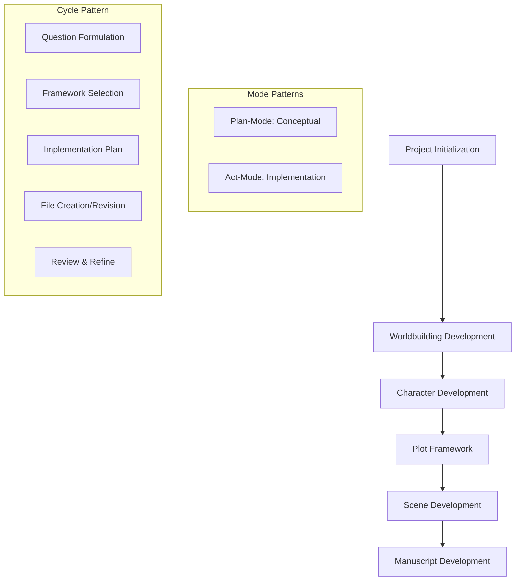

# LLM Workflow Planning: The Fractured Realms

## Purpose
This document outlines specific strategies and approaches for working with LLM assistants to develop "The Fractured Realms" novel using the narrative context network.

## Classification
- **Domain:** Process Planning
- **Stability:** Evolving
- **Abstraction:** Methodological
- **Confidence:** Exploratory

## Content

### LLM Workflow Overview

This workflow integrates LLM assistance into the narrative development process, using structured patterns of interaction to maximize the effectiveness of AI collaboration.



### Initialization Phase

#### LLM Initialization Session Plan
- **Session Goal:** Establish project foundations and framework selection
- **Mode Approach:** 
  - Begin in Plan mode to discuss concept, audience, scale, constraints
  - Switch to Act mode to create foundation documents using templates
- **Initial Questions:** 
  - "What are the central themes I want to explore in this fantasy novel?"
  - "What audience am I targeting and what are their expectations?"
  - "What makes my concept distinctive from other fantasy novels?"
  - "What worldbuilding frameworks would be most appropriate for my concept?"
  - "What constraints should I establish to keep the project focused?"
- **Expected Outcomes:** 
  - Completed project_definition.md
  - Completed constraints.md
  - Framework selection decisions

#### Example Plan Mode Conversation
```
ME: I want to create a fantasy novel about multiple realities with different physical laws that are starting to merge together.

LLM: That's an intriguing concept with a lot of potential. To help develop this into a full project, I have some questions:

1. What themes are you most interested in exploring through this premise?
2. Who is your target audience? (Adult, YA, etc.)
3. What type of protagonist would navigate these merging realities?
4. Are you thinking of a standalone novel or series potential?
5. What fantasy elements are most important to you? (magic systems, politics, adventure, etc.)

ME: I'm interested in exploring how perspective shapes reality, and how people with fundamentally different worldviews might find common ground. It's for adult readers who enjoy complex worldbuilding and philosophical themes. I'm thinking of a protagonist who can move between realities when others can't. I want it to be a standalone with series potential, and I'm particularly interested in developing unique magic systems for each reality.

LLM: [Detailed response about potential approaches, followed by framework recommendations]
```

#### Example Act Mode Instructions
```
ME: Let's start building the foundation documents. Please create the project_definition.md file following the template from the project_initialization.md document. Use the name "The Fractured Realms" for my novel and incorporate the concept we discussed about multiple realities with different physical laws that are beginning to merge.

LLM: [Creates the file with appropriate content]

ME: Now please create the constraints.md file that establishes creative boundaries for the project. I want to limit the project to 5 distinct realms, stick with a single POV character, and maintain a medieval technology level.

LLM: [Creates the constraints file]
```

### Development Phase

#### LLM Development Cycle Pattern
- **Plan-Act Pattern:**
  - Use Plan mode for conceptual exploration, problem-solving, and discussing options
  - Use Act mode for creating/modifying files and implementing decisions
  - Alternate between modes as needed for each development phase
- **Session Structure:**
  1. Begin with clear session goal related to current development phase
  2. Use Plan mode to explore options and select frameworks
  3. Switch to Act mode with specific implementation instructions
  4. Review results and refine through further iterations
- **Conversation Strategy:**
  - Frame requests in terms of specific narrative frameworks
  - Provide clear context about current development stage
  - Request specific file updates rather than general suggestions
  - Use technical terms from the narrative frameworks when applicable

#### Framework Implementation Prompts

##### For Worldbuilding
```
ME: I'd like to develop the magic system for The Fractured Realms using the Magic System Development Framework. I want each of the five realms to have a distinctive magic type tied to its physical properties, plus a rare "boundary magic" that only a few characters like my protagonist can use. Please help me implement this framework to create a cohesive system with clear rules, limitations, and consequences.

LLM: [Plan mode discussion of magic system options]

ME: That approach sounds great. Let's switch to Act mode and update the world/overview.md file to include this magic system. Please add a new section that implements the unified theory of fractured magic as we discussed.

LLM: [File update with magic system details]
```

##### For Character Development
```
ME: I need to create the protagonist, Elara, using the Character Development Framework from the context network. She should be a boundary walker from Ardenia who discovers her multi-realm affinity. Please help me explore her core traits, motivations, flaws, and arc.

LLM: [Plan mode discussion of character development]

ME: Now let's switch to Act mode. Please create a character profile for Elara in elements/characters/profiles/elara.md following the character profile template and incorporating the traits we discussed.

LLM: [Creates character profile file]
```

##### For Plot Development
```
ME: I want to develop the plot using the Story Circle Framework combined with the Fantasy Genre-Specific Plot Framework. The central conflict involves the weakening boundaries between realms and the competing approaches to addressing this crisis. Please help me map out the major plot points.

LLM: [Plan mode discussion of plot structure]

ME: That structure works well. Let's switch to Act mode and create the plot/overview.md file implementing this structure with the specific plot points we've identified.

LLM: [Creates plot overview file]
```

### Effective Prompting Strategies

#### Framework-Specific Prompting

When using narrative frameworks, structure prompts to:
1. Name the specific framework(s) being implemented
2. State the narrative element being developed
3. Provide key parameters or constraints
4. Request specific output format or file updates

**Example:**
```
Please apply the Scene Tension Framework to develop the confrontation scene where Elara first encounters the Umbrian shadow master. The scene should demonstrate growing tension through environmental, interpersonal, and internal conflict layers. Please update the scene in chapters/chapter7.md.
```

#### Iteration Prompting

For refining existing elements:
1. Reference the specific file being refined
2. Identify the aspect needing improvement
3. Provide the framework or approach for refinement
4. State the desired outcome

**Example:**
```
The dialogue in chapters/chapter3.md feels generic and doesn't reflect the different realm origins of the characters. Please revise the conversation between Elara and the Terrastrata scholar using the Dialogue Effectiveness Framework to better showcase their different cultural backgrounds and speech patterns.
```

#### Research Integration Prompting

For incorporating research or reference materials:
1. Identify the information source
2. Specify how it should inform the narrative element
3. Request framework-based integration
4. Define the output location

**Example:**
```
I've researched crystal formations and geological structures for the Terrastrata realm. Please help me integrate this information into the elements/world/terrastrata.md file using the Environmental Design Framework, particularly focusing on how these structures influence the architectural and cultural development of that realm.
```

### Review and Refinement Phase

#### LLM Review Processes
- **Content Review:**
  ```
  Please review chapters/chapter5.md for consistency with the established magic system rules. Identify any instances where the magic use violates the established constraints or where the effects don't align with the realm-specific properties defined in world/overview.md.
  ```

- **Consistency Checking:**
  ```
  Please analyze the character of Verin across all his appearances in chapters 3, 7, and 12 using the Character Consistency Framework. Identify any discrepancies in his behavior, speech patterns, or motivations, and suggest revisions to maintain consistency.
  ```

- **Refinement Approach:**
  ```
  The transition between scene 2 and 3 in chapter 9 feels abrupt. Using the Scene Transition Framework, please suggest 2-3 alternative approaches to create a smoother flow while maintaining tension, then implement the best option in the file.
  ```

### Special Process: Character Voice Development

For developing distinctive character voices based on realm origin:

1. **Analysis Phase:**
   ```
   Based on the Cultural Development Framework we've established for each realm, please analyze how a typical resident of [Realm] would speak. Consider cultural values, environmental influences, social structures, and linguistic markers we could incorporate.
   ```

2. **Implementation Phase:**
   ```
   Please review the dialogue for [Character] in chapter/chapter4.md and revise it to better reflect their [Realm] origin using the linguistic markers we've established. Maintain their personality and intent while making their realm background more evident in their speech patterns.
   ```

3. **Consistency Review:**
   ```
   Please check all dialogue from [Character] across chapters 1-5 and ensure consistent application of their realm-specific speech patterns. List any inconsistencies you find and suggest revisions.
   ```

### Special Process: World Detail Expansion

For expanding world details while maintaining consistency:

1. **Framework Selection:**
   ```
   I want to develop more detail about Vapori culture and society. Which specific frameworks from the context network would be most appropriate for this expansion while ensuring consistency with established elements?
   ```

2. **Guided Expansion:**
   ```
   Using the Cultural Development Framework and GRAPES Framework, please help me expand the social structures of Vaporis, particularly focusing on how their island-based society and wind magic have shaped family structures and governance systems.
   ```

3. **Integration Check:**
   ```
   Please review this expanded Vaporis cultural detail against existing world elements to identify any inconsistencies or integration opportunities with previously established elements.
   ```

## Relationships
- **Parent Nodes:** 
  - [context-network/examples/fantasy_novel_example/README.md] - implements - Project workflow
- **Child Nodes:** 
  - [none yet]
- **Related Nodes:** 
  - [context-network/processes/project_initialization.md] - applies - Uses initialization process
  - [context-network/processes/creation.md] - applies - Uses creation process 
  - [context-network/elements/narrative_frameworks_index.md] - references - Uses frameworks from this index

## Navigation Guidance
- **Access Context:** Reference this document when planning LLM interaction sessions for any phase of project development
- **Common Next Steps:** After reviewing this workflow, begin implementation with project initialization
- **Related Tasks:** Project development, framework implementation, narrative refinement
- **Update Patterns:** Update this document as effective LLM collaboration patterns emerge during development

## Metadata
- **Created:** 2025-05-22
- **Last Updated:** 2025-05-22
- **Updated By:** Cline Agent

## Change History
- 2025-05-22: Initial creation of LLM workflow planning document
