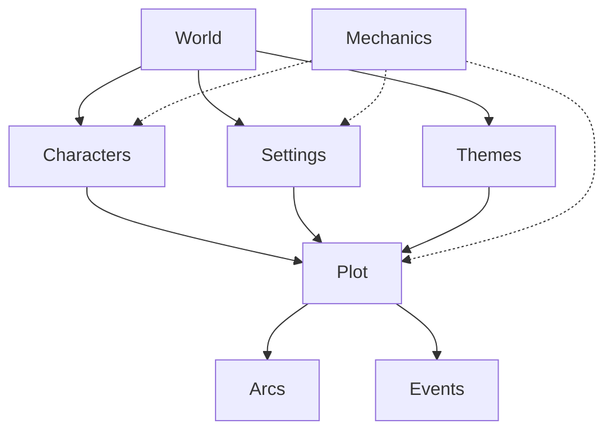
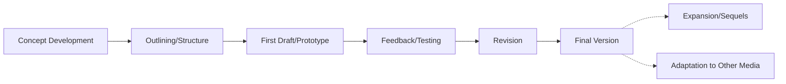

# Narrative Project Structure

## Purpose
This document provides an overview of the narrative project structure, including key storytelling elements, their relationships, and the principles guiding their design and integration.

## Classification
- **Domain:** Structure
- **Stability:** Semi-stable
- **Abstraction:** Structural
- **Confidence:** Established

## Content

### Narrative Structure Overview

[Provide a high-level description of the narrative structure, including its major elements and their relationships]



### Key Narrative Elements

#### World
[Description of the world/universe, its fundamental rules, history, and key characteristics. This encompasses the complete setting in which the narrative takes place.]

#### Characters
[Description of characters as narrative elements, their purposes, archetypes, and development patterns. This defines how characters function within the narrative structure.]

#### Plot
[Description of plot structure, including key events, turning points, and narrative progression. This defines how the story unfolds.]

#### Settings
[Description of specific locations, environments, and their narrative significance. These are distinct places within the overall world.]

#### Themes
[Description of thematic elements, motifs, and symbolic frameworks that provide meaning and depth to the narrative.]

#### Arcs
[Description of character and plot arcs, their progression patterns, and resolution approaches.]

#### Events
[Description of significant narrative events, their causality, and impact on the story progression.]

#### Mechanics (for games/interactive fiction)
[Description of gameplay or interactive elements, their integration with narrative, and player/reader agency.]

### Narrative Element Interactions

#### Character-World Interactions
[Describe how characters are shaped by and influence the world, including cultural background, historical context, and environmental adaptation]

#### Setting-Plot Interactions
[Describe how settings influence plot events and how the plot moves through different settings]

#### Character-Plot Interactions
[Describe how characters drive plot and how plot events transform characters]

#### Theme-Element Interactions
[Describe how thematic elements manifest across characters, settings, and plot]

#### Mechanics-Narrative Interactions (for games/interactive fiction)
[Describe how game/interactive mechanics reinforce narrative elements and how narrative justifies mechanical systems]

### Narrative Frameworks and Methods

| Narrative Area | Frameworks/Methods | Application |
|-------|--------------|---------------|
| Plot Structure | [Hero's Journey, Three-Act Structure, Five-Act Structure, etc.] | [How these frameworks are applied to the project] |
| Character Development | [Character Arc Types, Personality Systems, etc.] | [How these frameworks shape character creation and evolution] |
| Worldbuilding | [Cultural Construction, Historical Development, etc.] | [How these methods create coherent and believable worlds] |
| Theme Exploration | [Motif Development, Symbol Systems, etc.] | [How these approaches reinforce thematic depth] |
| Setting Creation | [Environmental Storytelling, Location Design, etc.] | [How these methods create meaningful spaces] |
| Mechanics (for games) | [Player Agency Models, Risk/Reward Systems, etc.] | [How these systems enhance narrative experience] |

### Narrative Success Criteria

#### Coherence
[Description of narrative coherence requirements and how the structure creates a unified story experience]

#### Engagement
[Description of audience engagement goals and how the structure creates and maintains interest]

#### Emotional Impact
[Description of emotional impact objectives and how the structure delivers meaningful experiences]

#### Thematic Resonance
[Description of thematic depth requirements and how the structure conveys meaningful ideas]

#### Memorability
[Description of memorable moment creation and how the structure delivers standout experiences]

#### Pacing and Flow
[Description of rhythm requirements and how the structure manages tension and release]

#### World Consistency
[Description of worldbuilding consistency requirements and how the structure maintains believability]

#### Character Authenticity
[Description of character realism/believability requirements and how the structure creates compelling personalities]

### Creation Approach

[Description of how the narrative will be developed, including creative phases, iteration cycles, and feedback processes]



### Narrative Evolution

[Description of how the narrative structure might evolve over time, including sequel potential, world expansion, and character development opportunities]

### Documentation Structure

The narrative elements are documented in dedicated sections of the context network:

```
elements/
├── world/                # World and setting information
│   ├── overview.md       # High-level worldbuilding
│   ├── history.md        # Historical timeline
│   ├── rules.md          # Physical/magical/social rules
│   └── cultures.md       # Cultural groups and dynamics
│
├── characters/           # Character information
│   ├── overview.md       # Character design principles
│   ├── protagonists/     # Main character details
│   ├── antagonists/      # Opposition character details
│   └── supporting/       # Supporting character details
│
├── plot/                 # Plot information
│   ├── overview.md       # Plot structure and principles
│   ├── arcs.md           # Major and minor arcs
│   ├── events.md         # Key story events
│   └── outline.md        # Detailed story outline
│
├── settings/             # Setting information
│   ├── overview.md       # Setting design principles
│   ├── locations/        # Specific location details
│   ├── maps.md           # Spatial relationships
│   └── descriptions.md   # Standard setting descriptions
│
├── themes/               # Thematic information
│   ├── overview.md       # Core themes and motifs
│   ├── symbols.md        # Symbol system and usage
│   └── progressions.md   # Thematic development
│
└── mechanics/            # For games/interactive narratives
    ├── overview.md       # System design principles
    ├── rules.md          # Core mechanics
    ├── progression.md    # Player/character advancement
    └── integration.md    # Narrative-mechanic integration
```

## Relationships
- **Parent Nodes:** [foundation/project_definition.md]
- **Child Nodes:** 
  - [elements/world/overview.md] - details - Worldbuilding structure
  - [elements/characters/overview.md] - details - Character system
  - [elements/plot/overview.md] - details - Plot framework
  - [elements/settings/overview.md] - details - Setting design
  - [elements/themes/overview.md] - details - Thematic framework
  - [elements/mechanics/overview.md] - details - Mechanical systems (for games)
  - [decisions/*] - justifies - Key narrative decisions
- **Related Nodes:** 
  - [foundation/principles.md] - guides - Storytelling principles
  - [connections/dependencies.md] - details - Dependencies between narrative elements
  - [connections/interfaces.md] - specifies - Interfaces between narrative systems

## Navigation Guidance
- **Access Context:** Use this document when needing to understand the overall narrative structure and design
- **Common Next Steps:** After reviewing this structure, typically explore specific element directories (world, characters, plot) or narrative decision records
- **Related Tasks:** Story development, character creation, world building, plot structuring, thematic development
- **Update Patterns:** This document should be updated when there are significant changes to the narrative approach or storytelling methodology

## Metadata
- **Created:** [Date]
- **Last Updated:** [Date]
- **Updated By:** [Role/Agent]

## Change History
- [Date]: Initial creation of narrative structure document
