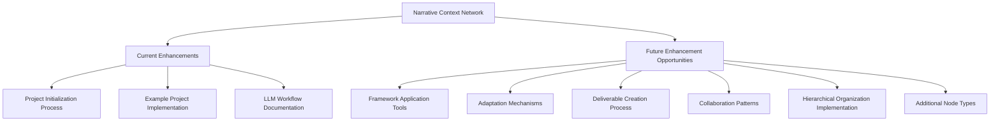

# Narrative Context Network Enhancement Guide

## Purpose
This document provides an overview of the enhancements made to the narrative context network template and outlines additional improvement opportunities to make it an even more effective starting place for narrative projects.

## Classification
- **Domain:** Meta Documentation
- **Stability:** Evolving
- **Abstraction:** Strategic
- **Confidence:** Established

## Content

### Enhancement Overview

The narrative context network has been enhanced with several key additions to improve usability, provide concrete examples, and streamline the process of starting new narrative projects.

### Current Enhancements

#### 1. Project Initialization Process

The new `processes/project_initialization.md` document provides a comprehensive guide for starting narrative projects within the context network, including:

- Project definition template
- Constraint definition framework
- Framework selection decision trees
- Project structure setup guidance
- Narrative seeds template
- LLM workflow approach template
- Initial element creation checklists

This enhancement addresses the need for clearer starting points and structured setup processes when beginning a new narrative project.

#### 2. Example Project Implementation

The `/examples/fantasy_novel_example/` directory demonstrates practical application of the context network's frameworks and processes through a sample fantasy novel project "The Fractured Realms":

- `README.md` - Overview of the example and its purpose
- `foundation/project_definition.md` - Example of defining project parameters
- `foundation/constraints.md` - Example of establishing creative boundaries
- `elements/world/overview.md` - Demonstration of applying worldbuilding frameworks
- `planning/llm_workflow.md` - Example of LLM collaboration strategies

This enhancement provides concrete examples of how abstract frameworks translate into practical narrative development.

#### 3. LLM Workflow Documentation

The example project's `planning/llm_workflow.md` document offers detailed guidance on effective collaboration with LLM assistants, including:

- Mode-specific interaction patterns
- Example conversations for different development phases
- Framework implementation prompts
- Effective prompting strategies
- Specialized processes for character voice and world development
- Review and refinement methodologies

This enhancement helps users maximize the value of LLM assistance when working with the context network.

### Future Enhancement Opportunities

#### 1. Framework Application Tools

Additional tools could be developed to make the existing frameworks more actionable:

- **Decision trees** for selecting appropriate frameworks based on project type and goals
- **Interactive worksheets** for applying frameworks to specific narrative elements
- **Evaluation checklists** to assess framework implementation effectiveness
- **Implementation templates** for common framework applications
- **Visualization tools** for framework relationships and dependencies

#### 2. Adaptation Mechanisms

Guidelines for adapting the context network to different narrative formats and scales:

- **Medium-specific adaptations** for different formats (novel, game, screenplay, etc.)
- **Scale adjustment strategies** for projects of different sizes (short story vs. epic series)
- **Genre-specific guidance** for adapting frameworks to genre conventions
- **Simplification patterns** for quick-start projects
- **Expansion patterns** for complex narrative worlds

#### 3. Deliverable Creation Process

Clear paths from framework to final output:

- **Export and compilation processes** for manuscript generation
- **Framework-to-draft workflows** for converting structured elements to narrative prose
- **Review and validation procedures** for manuscript consistency
- **Version management approaches** for evolving narratives
- **Publication preparation guidelines** tailored to different media

#### 4. Collaboration Patterns

Support for team-based narrative development:

- **Role-specific guidance** for writers, editors, designers working together
- **Multi-agent collaboration workflows** for utilizing different LLM strengths
- **Feedback integration processes** for narrative review cycles
- **Parallel development patterns** for concurrent work on different elements
- **Synchronization procedures** for maintaining consistency across team members

#### 5. Hierarchical Organization Implementation

As documented in the maintenance guide, implementing hierarchical organization for files that exceed size thresholds or have specific characteristics:

- **File Size Analysis Tools** for identifying files that would benefit from hierarchical breakdown
- **Conversion Templates** for different types of content (frameworks, research, updates)
- **Category Identification Patterns** for logical content grouping
- **Index Page Templates** for different hierarchy levels
- **Navigation Enhancement Strategies** for maintaining smooth traversal of hierarchical structures
- **Content Migration Procedures** for moving from flat files to hierarchical organization

#### 6. Additional Node Types

New framework types to address specific narrative needs:

- **Dialogue frameworks** for character interactions and speech patterns
- **Pacing tools** for managing narrative rhythm and flow
- **Emotional resonance mappings** for tracking reader/audience experience
- **Adaptation frameworks** for cross-media development
- **Interactive narrative decision trees** for branching stories
- **Feedback incorporation systems** for iterative development

### Implementation Priorities

Based on which enhancements would most immediately improve the template's effectiveness as a starting place, the following implementation priorities are recommended:

#### Priority 1: Additional Example Projects
- Develop examples for different narrative formats (screenplay, game narrative, etc.)
- Create simplified "quick start" examples for smaller projects
- Provide examples of framework adaptation for different genres

#### Priority 2: Framework Application Tools
- Create worksheet templates for each major framework
- Develop decision trees for framework selection based on project needs
- Create evaluation rubrics for framework implementation

#### Priority 3: Deliverable Creation Process
- Develop clear processes for moving from structured elements to draft manuscript
- Create export/compilation guidance for different output formats
- Provide revision and validation procedures

#### Priority 4: Hierarchical Organization Implementation
- Develop file size analysis tools to identify candidates for reorganization
- Create templates for different levels of hierarchy (main index, category index, item files)
- Document migration procedures for larger files
- Implement example conversions for key framework files

#### Priority 5: Dialogue Frameworks
- Develop comprehensive dialogue frameworks for character voice development
- Create speech pattern templates for different character types
- Provide dialogue scene construction frameworks

### Enhancement Workflow

For implementing future enhancements, the following workflow is recommended:

1. **Review current frameworks** to identify connection points and integration requirements
2. **Research best practices** specific to the enhancement area
3. **Develop initial documentation** following the node template
4. **Create example implementations** demonstrating practical application
5. **Test against sample projects** to verify effectiveness
6. **Integrate with existing documentation** by updating relationship references
7. **Update the narrative_frameworks_index.md** document to include new frameworks

## Relationships
- **Parent Nodes:** 
  - [context-network/meta/maintenance.md] - implements - Provides enhancement guidance as part of maintenance
- **Child Nodes:** 
  - [none yet]
- **Related Nodes:** 
  - [context-network/processes/project_initialization.md] - documents - Describes new initialization process
  - [context-network/examples/fantasy_novel_example/README.md] - documents - Describes example implementation
  - [context-network/elements/narrative_frameworks_index.md] - updates - Enhancement areas will expand this index

## Navigation Guidance
- **Access Context:** Reference this document when planning further enhancements to the context network
- **Common Next Steps:** After reviewing this guide, examine the implemented enhancements and prioritize future development
- **Related Tasks:** Framework development, example creation, documentation improvement
- **Update Patterns:** This document should be updated as enhancements are implemented or new enhancement opportunities are identified

## Metadata
- **Created:** 2025-05-22
- **Last Updated:** 2025-05-22
- **Updated By:** Cline Agent

## Change History
- 2025-05-22: Initial creation of enhancement guide
