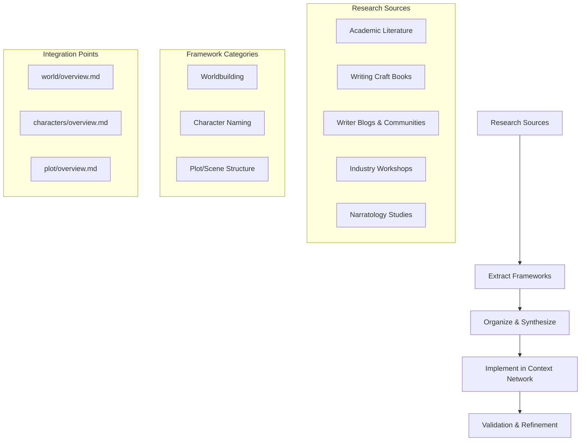

# Research Strategy for Narrative Frameworks

## Purpose
This document outlines the research strategy for identifying and implementing industry-recognized best practices for worldbuilding, character naming, and plot/scene development that are not tied to a single author or trademarked system.

## Classification
- **Domain:** Research Planning
- **Stability:** Evolving
- **Abstraction:** Methodological
- **Confidence:** Initial

## Content

### Research Overview

This research plan establishes a systematic approach to gathering, evaluating, and implementing narrative frameworks that represent consensus best practices across multiple authoritative sources. The goal is to incorporate these frameworks into our narrative context network to guide worldbuilding, character naming, and plot/scene development.

### 1. Source Identification

#### Academic & Scholarly Sources
- Academic journals on narratology and creative writing
- Published dissertations on worldbuilding techniques
- Literary criticism focusing on plot structure
- Linguistic studies on naming patterns and impact
- Anthropological research on cultural development

#### Industry Professional Resources
- Writing craft books with wide industry adoption
- Writing conference proceedings and presentations
- Industry blogs and websites with scholarly citations
- Workshops and masterclasses from multiple established writers
- Literary agent and editor guidelines and recommendations

#### Community Knowledge Sources
- Writing communities' collective wisdom
- Analyses of common practices across successful narratives
- Discussions in professional forums where consensus emerges
- Pattern analysis across successful works in different genres
- Cross-cultural storytelling practices with common elements

### 2. Framework Extraction Process

#### For Worldbuilding Frameworks
1. Identify recurring worldbuilding principles mentioned across multiple authoritative sources
2. Document approaches for creating consistent world rules, cultures, histories
3. Collect methodologies for avoiding common worldbuilding pitfalls
4. Research ecological, sociological, and technological development frameworks
5. Identify cultural development patterns that maintain internal consistency
6. Document approaches to geography, climate, and environmental influences
7. Research economic systems and resource management frameworks

#### For Character Naming Criteria
1. Research linguistic principles for effective character naming
2. Identify patterns in successful vs. clichéd character names
3. Document cultural considerations and pitfalls in naming practices
4. Research psychological impact of names on reader perception
5. Compile naming conventions across different genres and settings
6. Analyze phonological patterns in memorable character names
7. Research cultural sensitivity guidelines for character naming

#### For Plot/Scene Building
1. Extract scene structure frameworks with multiple source validation
2. Identify universal principles of narrative tension and resolution
3. Collect methodologies for managing scene progression
4. Research cognitive and emotional engagement principles in scene design
5. Document pacing mechanisms and their narrative effects
6. Analyze conflict development and resolution patterns
7. Research information revelation strategies and their impact

### 3. Synthesis Methodology

1. Cross-reference identified frameworks to find overlapping principles
2. Prioritize frameworks with the strongest evidence base and widest adoption
3. Create composite frameworks that represent consensus best practices
4. Organize frameworks by their application to different narrative types and genres
5. Identify complementary frameworks that work together systematically
6. Create visual models of framework interactions and dependencies
7. Develop evaluation criteria for framework effectiveness

### 4. Implementation Approach

For each framework category:
1. Create dedicated files within appropriate element directories
2. Structure content with clear examples and application guidelines
3. Include checklists and evaluation criteria
4. Provide references to source material (without prioritizing any single author)
5. Create integration points with existing narrative principles
6. Develop practical worksheets and templates for application
7. Create decision trees for applying frameworks in different contexts

### Key Research Questions

1. What worldbuilding frameworks appear consistently across multiple authoritative sources?
2. What criteria distinguish fresh character names from clichéd ones across different genres?
3. What scene structure patterns have been identified by multiple narrative theorists?
4. How do these frameworks support the narrative principles already defined in the context network?
5. What evaluation methods can validate the effectiveness of these frameworks?
6. How do these frameworks adapt to different genres and narrative styles?
7. What are the common pitfalls or challenges when implementing these frameworks?

### Initial Research Focus Areas

#### For Worldbuilding
- Cultural development frameworks (anthropological approaches)
- World consistency principles (physics, magic systems, technology)
- Environmental design principles (geography, ecology, settlement patterns)
- Historical development frameworks (civilization cycles, conflict patterns)
- Societal structure models (governance, economics, class systems)
- Belief system development (religions, philosophies, values)
- Technology and magic system constraints and implications

#### For Character Naming
- Phonetic symbolism research
- Cross-cultural naming conventions
- Genre expectations and subversions
- Linguistic principles for memorable names
- Cultural sensitivity and appropriation concerns
- Historical naming patterns and evolution
- Name-to-character attribute relationships

#### For Plot/Scene Building
- Scene-sequel frameworks
- Conflict escalation patterns
- Information revelation principles
- Emotional engagement structures
- Pacing frameworks for different narrative types
- Cause-and-effect relationship models
- Tension and release mechanisms
- Transition techniques between scenes

### Research Timeline and Priorities

#### Phase 1: Initial Source Collection (1-2 weeks)
- Compile bibliography of authoritative sources
- Create categorization system for sources
- Develop source evaluation criteria
- Establish research collaboration methodology

#### Phase 2: Framework Extraction (2-3 weeks)
- Extract key frameworks from identified sources
- Document source references and citations
- Create preliminary framework documentation
- Identify gaps requiring additional research

#### Phase 3: Framework Synthesis (1-2 weeks)
- Cross-reference and consolidate frameworks
- Develop composite models from multiple sources
- Create visual representations of frameworks
- Validate frameworks against successful examples

#### Phase 4: Implementation (Ongoing)
- Integrate frameworks into context network
- Create application guidelines and examples
- Develop evaluation methodologies
- Iterate based on practical application

## Relationships
- **Parent Nodes:** 
  - [context-network/planning/roadmap.md] - fits-within - Research contributes to overall project roadmap
- **Child Nodes:** 
  - [future files for specific research findings]
- **Related Nodes:** 
  - [elements/world/overview.md] - informs - Research will enhance worldbuilding framework
  - [elements/characters/overview.md] - informs - Research will enhance character development framework
  - [elements/plot/overview.md] - informs - Research will enhance plot development framework
  - [foundation/principles.md] - aligns-with - Research must align with established narrative principles

## Navigation Guidance
- **Access Context:** Use this document when planning research activities, reviewing research progress, or integrating new frameworks into the context network
- **Common Next Steps:** After reviewing this strategy, proceed to specific research tasks, source identification, or framework documentation
- **Related Tasks:** Literature review, framework development, context network enhancement
- **Update Patterns:** This document should be updated as research progresses and new priorities emerge

## Metadata
- **Created:** [Current Date]
- **Last Updated:** [Current Date]
- **Updated By:** Cline Agent

## Change History
- [Current Date]: Initial creation of research strategy document
