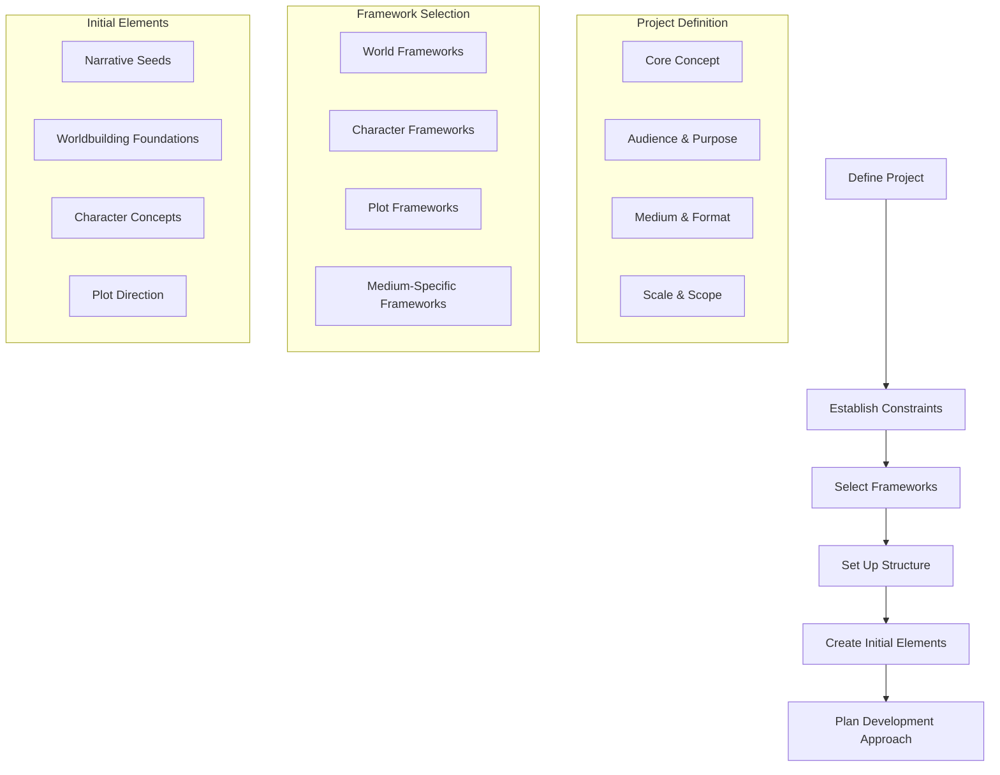

# Project Initialization Process

## Purpose
This document provides a structured process for initializing new narrative projects within the context network. It guides users through defining project parameters, establishing constraints, and setting up the necessary foundation before beginning creative development.

## Classification
- **Domain:** Process
- **Stability:** Semi-stable
- **Abstraction:** Structural
- **Confidence:** Established

## Content

### Project Initialization Overview

Effective narrative projects begin with clear definition and structural planning. This initialization process guides you through setting up your project in the context network with appropriate scope, goals, and constraints.



### 1. Project Definition Template

Fill out the following template in your project's `foundation/project_definition.md` file:

```markdown
# Project Definition: [Project Title]

## Core Concept
[1-2 paragraph summary of the central narrative concept]

## Audience and Purpose
- **Target Audience:** [Describe your intended audience]
- **Purpose:** [Entertainment, education, persuasion, etc.]
- **Experience Goals:** [What you want the audience to feel/learn/understand]

## Medium and Format
- **Primary Medium:** [Novel, short story, screenplay, game, etc.]
- **Format Details:** [Length, structure, delivery method]
- **Secondary Media:** [If applicable - adaptations, supplements, etc.]

## Scale and Scope
- **Project Size:** [Single work, series, universe, etc.]
- **Timeline:** [Expected development timeline]
- **Resource Requirements:** [Team size, budget considerations, tools]

## Core Themes
- [Theme 1]: [Brief exploration]
- [Theme 2]: [Brief exploration]
- [Theme 3]: [Brief exploration]

## Project Success Criteria
- [Criterion 1]
- [Criterion 2]
- [Criterion 3]
```

### 2. Constraint Definition Framework

Define your project constraints in your `foundation/constraints.md` file using this framework:

```markdown
# Project Constraints

## Creative Constraints
- **Genre Conventions:** [Required/expected elements for your genre]
- **Worldbuilding Limits:** [Technological, magical, physical rules]
- **Narrative Boundaries:** [Topics, themes, or plot elements to avoid]
- **Stylistic Parameters:** [Voice, tone, stylistic choices]

## Technical Constraints
- **Medium Limitations:** [Constraints of your chosen medium]
- **Production Requirements:** [Technical specifications]
- **Distribution Considerations:** [How the work will reach audiences]

## External Constraints
- **Audience Expectations:** [Consideration of audience needs/sensitivities]
- **Market Considerations:** [Commercial requirements if applicable]
- **Timeline Constraints:** [Deadlines, milestones]
- **Resource Limitations:** [Budget, team size, tools]

## Intentional Constraints
- **Self-Imposed Challenges:** [Constraints added for creative reasons]
- **Experimental Parameters:** [Areas where you're trying new approaches]
```

### 3. Framework Selection Guide

Use this decision tree to select appropriate frameworks for your project from the narrative context network:

#### Worldbuilding Framework Selection

1. Identify your narrative's worldbuilding needs:
   - Historical/realistic setting → Historical Layering Framework
   - Fantasy/speculative setting → Magic System + GRAPES Framework
   - Science fiction setting → Technology Integration + GRAPES Framework
   - Contemporary setting → Cultural Development Framework

2. Determine world scope:
   - Limited location focus → Character-Centric Worldbuilding
   - Expansive world → Full GRAPES Framework
   - Abstracted/conceptual → Economy of Invention + Familiar-Strange Balance

3. For specialized elements, add:
   - Magical elements → Magic System Development Framework
   - Multiple cultures → Cultural Development Framework
   - Environmental focus → Ecological Worldbuilding Framework
   - Economic themes → Economic System Development Framework
   - Religious elements → Religious System Development Framework
   - Language importance → Linguistic Development Framework

#### Character Framework Selection

1. Identify character naming approach:
   - Historical/cultural basis → Cultural Coherence + Historical Fiction Authenticity
   - Fantasy/invented → Phonological Significance + Fantasy Name Cliché Assessment
   - Science fiction → Science Fiction Name Evolution Framework
   - Contemporary → Sociological Naming System

2. Test selected approach with:
   - Pronunciation Testing
   - Association Testing
   - Distinctiveness Testing
   - Consistency Testing

#### Plot Framework Selection

1. Identify primary narrative structure:
   - Character transformation → Story Circle Framework
   - Complex/multiple storylines → Multiple Storyline Framework
   - Thematic exploration → Value Shift Framework
   - Action-driven → Dramatic Arc Framework

2. Add specialized elements as needed:
   - Genre-specific elements → Appropriate Genre-Specific Plot Framework
   - Cross-cultural influences → Cross-Cultural Storytelling Frameworks
   - Interactive elements → Interactive Narrative Frameworks
   - Digital media integration → Digital-Era Narrative Frameworks
   - Visual storytelling → Visual Storytelling Frameworks

3. For scene development:
   - Standard scene construction → Scene-Sequel Framework
   - High emotional impact → Scene Tension + Emotional Resonance Mapping
   - Setting-driven scenes → Scene Setting Integration Framework
   - Dialogue-focused scenes → Scene Dialogue Effectiveness Framework

### 4. Project Structure Setup

Create the following initial structure in your context network:

1. **Foundation Layer:**
   - Complete project_definition.md
   - Create constraints.md
   - Establish project_principles.md with core narrative values

2. **Elements Layer - Initial Setup:**
   - Create world/overview.md with world concept
   - Create characters/overview.md with character approach
   - Create plot/overview.md with structural approach

3. **Planning Layer:**
   - Create roadmap.md with development milestones
   - Create research_needs.md to identify required research

### 5. Narrative Seeds Template

Use this template to create initial narrative seeds in `elements/narrative_seeds.md`:

```markdown
# Narrative Seeds

## Concept Seeds
- [Concept 1]: [Brief description and potential]
- [Concept 2]: [Brief description and potential]
- [Concept 3]: [Brief description and potential]

## Character Seeds
- [Character 1]: [Core concept, potential role, key traits]
- [Character 2]: [Core concept, potential role, key traits]
- [Character 3]: [Core concept, potential role, key traits]

## Setting Seeds
- [Setting 1]: [Brief description, atmospheric elements, narrative potential]
- [Setting 2]: [Brief description, atmospheric elements, narrative potential]
- [Setting 3]: [Brief description, atmospheric elements, narrative potential]

## Plot Seeds
- [Plot Element 1]: [Brief description, potential development]
- [Plot Element 2]: [Brief description, potential development]
- [Plot Element 3]: [Brief description, potential development]

## Thematic Seeds
- [Theme 1]: [Brief description, potential exploration methods]
- [Theme 2]: [Brief description, potential exploration methods]
- [Theme 3]: [Brief description, potential exploration methods]
```

### 6. LLM Workflow Approach Template

Use this template to plan your development approach with LLM assistance in `planning/llm_workflow.md`:

```markdown
# LLM Workflow Planning

## Initialization Phase

### LLM Initialization Session Plan
- **Session Goal:** Set up project foundation
- **Mode Approach:** Plan mode for conceptual discussion, Act mode for file creation
- **Initial Questions:** [List of questions to clarify project direction]
- **Expected Outcomes:** Completed project_definition.md, constraints.md

## Development Phase

### LLM Development Cycle Pattern
- **Plan-Act Pattern:** [How you'll alternate between modes]
- **Session Structure:** [Typical session workflow]
- **Conversation Strategy:** [How to frame requests to get best results]

### Framework Implementation Prompts
- **For Worldbuilding:** [Template prompts for effective worldbuilding assistance]
- **For Character Development:** [Template prompts for character creation]
- **For Plot Development:** [Template prompts for plot construction]

## Review and Refinement Phase

### LLM Review Processes
- **Content Review:** [How to use LLM to evaluate narrative elements]
- **Consistency Checking:** [Prompts for finding inconsistencies]
- **Refinement Approach:** [Structure for improvement cycles]
```

### 7. Initial Element Creation Guide

The following checklists guide creation of initial narrative elements:

#### Worldbuilding Initial Elements
- [ ] Core world concept (1-2 paragraphs)
- [ ] Application of selected worldbuilding frameworks
- [ ] GRAPES overview (basic Geography, Religion, Achievement, Politics, Economics, Social Structure)
- [ ] List of distinctive world elements
- [ ] Key historical events or timeline
- [ ] Cultural patterns and diversity
- [ ] World rules (physical, magical, technological)

#### Character Initial Elements
- [ ] Protagonist concept
- [ ] Antagonist or opposing force concept
- [ ] Supporting character concepts
- [ ] Character naming approach using selected frameworks
- [ ] Character relationship map
- [ ] Character development arcs

#### Plot Initial Elements
- [ ] Core conflict definition
- [ ] Selected plot structure application
- [ ] Major plot points identification
- [ ] Narrative pacing approach
- [ ] Scene construction methodology
- [ ] Plot-character integration points

## Relationships
- **Parent Nodes:** 
  - [context-network/processes/creation.md] - implements - Provides specific process for project creation
- **Child Nodes:** 
  - [none yet]
- **Related Nodes:** 
  - [foundation/project_definition.md] - informs - Initialization establishes project definition
  - [foundation/constraints.md] - creates - Process results in constraints documentation
  - [planning/roadmap.md] - precedes - Initialization happens before roadmap development
  - [elements/narrative_seeds.md] - creates - Process results in initial narrative seeds

## Navigation Guidance
- **Access Context:** Use this document when starting a new narrative project to ensure comprehensive setup
- **Common Next Steps:** After completing initialization, proceed to detailed worldbuilding, character development, or plot planning based on project priorities
- **Related Tasks:** Project definition, constraint establishment, framework selection
- **Update Patterns:** This document should be updated as new frameworks are added to the context network or improved initialization processes are developed

## Metadata
- **Created:** 2025-05-22
- **Last Updated:** 2025-05-22
- **Updated By:** Cline Agent

## Change History
- 2025-05-22: Initial creation of project initialization process document
